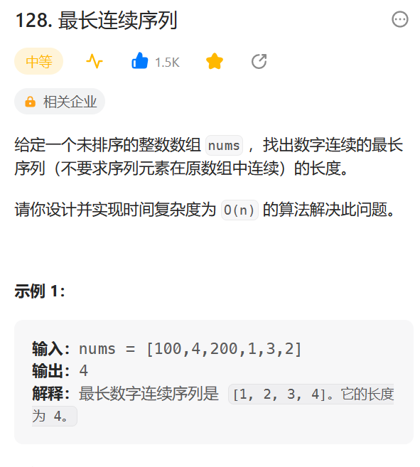

# 128. 最长连续序列

## 题目
  


## 思路

* 使用HashSet
* 对于集合中的每一个元素num
* 向左边不断试探num - 1 是否存在，看看左边界最远到达哪里
* 然后从左边界开始，向右边出发，不断试探右边界是否存在
* 最后右边界和左边界之间的距离就是最大连续长度


## 代码

* 超时的代码
```java
class Solution {
    public int longestConsecutive(int[] nums) {
        // 设置一个哈希容器
        HashMap<Integer,Integer> map = new HashMap<>();
        // 统计每一个数字出现的次数
        for(int i = 0; i < nums.length; i++)
        {
            // 判断是否存在该键
            if(map.containsKey(nums[i])){
                int v = map.get(nums[i]);//获取元素值
                v++;
                map.put(nums[i],v);// 重新覆盖
            }else{
                map.put(nums[i],1);// 不存在使用1进行赋值
            }
        }

        // 超出时间复杂度  双重循环 O(n2)
        int res = 0;// 统计最大连续长度  end - start + 1
        // Arrays.sort(map.keySet());
        for(Integer j:map.keySet()){
            int k = j;
            // 对于每一个元素 开始向后遍历 试探存不存在即可
            while(map.containsKey(k + 1)){
                k++;
            }
            res = res > (k - j + 1) ? res: (k - j + 1);
        }

        return res;

    }
}

```

* 使用HashSet
```java
class Solution {
    public int longestConsecutive(int[] nums) {
        Set<Integer> set = new HashSet<>();
        for(int num:nums){
            set.add(num);// 将元素添加到集合当中
        }

        int res = 0;
        for(int num:nums){
            // 遍历集合当中所有的元素
            if(set.contains(num - 1)){
                // 遍历左边界  查看左边界最远到达的地方
                continue;
            }else{
                // 查看右边界到达的地方  然后计算长度
                int count = 0;
                // 从左边界num开始  不断试探右边界
                while(set.contains(num++)){
                    count++;
                }
                res = Math.max(res,count);
            }
        }
        return res;
    }
}

```

