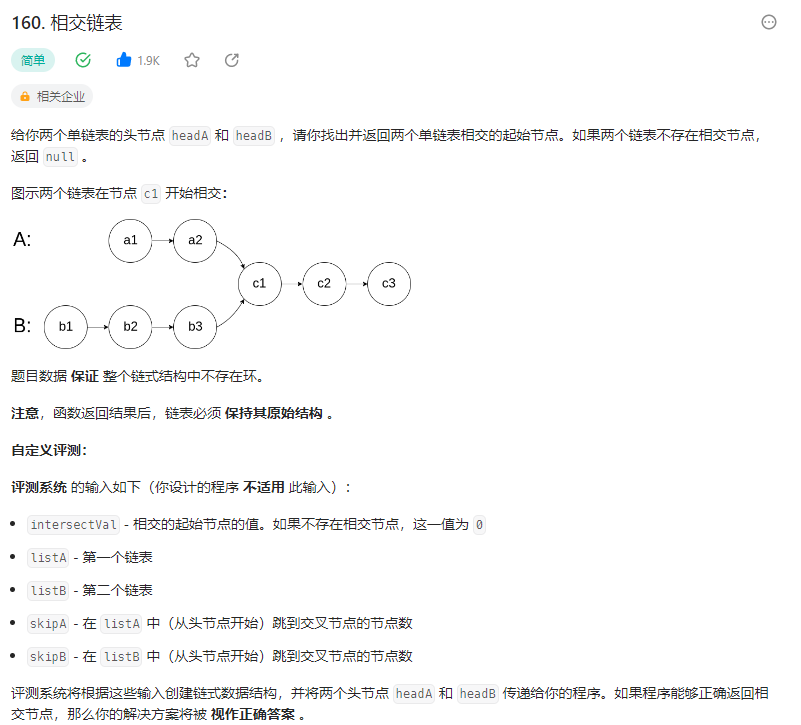

# 160. 相交链表

## 题目

  


## 思路

* 寻找交点 就是寻找地址值相同的节点
* 设置一个双重循环，外层循环是headA,内存循环是headB
* 对于headA的每一个节点，headB从头到尾遍历，比较每一个节点的地址值和当前headA节点的地址值是不是一致，如果是，直接返回该节点即可

## 代码

```java
/**
 * Definition for singly-linked list.
 * public class ListNode {
 *     int val;
 *     ListNode next;
 *     ListNode(int x) {
 *         val = x;
 *         next = null;
 *     }
 * }
 */
public class Solution {
    public ListNode getIntersectionNode(ListNode headA, ListNode headB) {
        // 双重循环遍历每一个 比较地址值
        // 找出第一个地址值相同的节点 就是相交的起始节点

        ListNode tmp = headB;

        while(headA != null){
            // 循环遍历B 将每一个节点值和当前A 的节点地址值进行比较
            ListNode n = tmp;// 每次都将n指针指向B第一个节点  重置
            while(n != null){
                if(headA == n){
                    return headA;
                }
                else{
                    n = n.next;
                }
            }

            headA = headA.next;
        }

        return null;
    }
}

```

