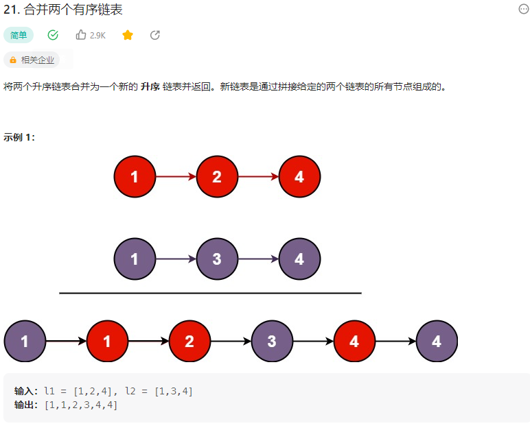

# 21. 合并两个有序链表

## 题目
  


## 思路
* 归并排序
* 比较两个单链表每一个节点，将较小元素的节点值封装成一个新的节点添加到一个新的链表中
* 如果两个单链表长度不一致，也就是有一个链表指针指向null ,那么将另一个链表中的所有节点全部添加到新的链表中

## 代码

```java
/**
 * Definition for singly-linked list.
 * public class ListNode {
 *     int val;
 *     ListNode next;
 *     ListNode() {}
 *     ListNode(int val) { this.val = val; }
 *     ListNode(int val, ListNode next) { this.val = val; this.next = next; }
 * }
 */
class Solution {
    public ListNode mergeTwoLists(ListNode list1, ListNode list2) {
        // 使用归并排序

        // 创建一个哑节点
        ListNode p = new ListNode(0);
        ListNode q = p;// 用于最后返回头指针 第一个节点的地址  return q.next

        while(list1 != null || list2 != null){
            // 归并排序
            if(list1 == null){
                // 将list2中的元素取出来 送入p中
                int c = list2.val;
                ListNode tmp = new ListNode(c);
                p.next = tmp;
                p = p.next;
                list2 = list2.next;
            }else if(list2 == null){
                // 将list1 中的元素取出来送入p中
                int b = list1.val;
                ListNode tmp = new ListNode(b);
                p.next = tmp;
                p = p.next;
                list1 = list1.next;
            }else{
                if(list1.val < list2.val){
                    // 将较小的元素封装成节点
                ListNode n = new ListNode(list1.val);
                p.next = n;
                p = p.next;
                list1 = list1.next;
            }else{
                ListNode m = new ListNode(list2.val);
                p.next = m;
                p = p.next;
                list2 = list2.next;
            }
            }

            
        }

        return q.next;// 出去第一个哑节点
    }
}

```

