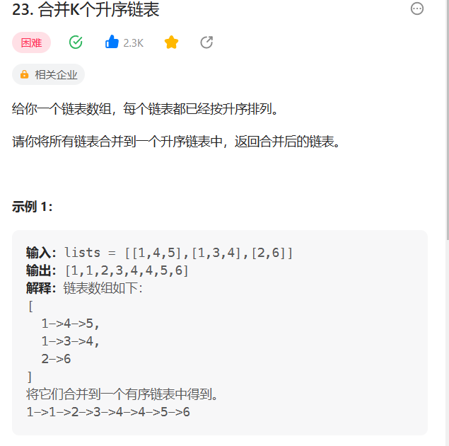

# 23. 合并K个升序链表

## 题目
  


## 思路

* 遍历链表数组，两两合并链表
* 对于合并链表 使用归并排序

## 代码

```java
/**
 * Definition for singly-linked list.
 * public class ListNode {
 *     int val;
 *     ListNode next;
 *     ListNode() {}
 *     ListNode(int val) { this.val = val; }
 *     ListNode(int val, ListNode next) { this.val = val; this.next = next; }
 * }
 */
class Solution {
    public ListNode mergeKLists(ListNode[] lists) {
        ListNode res = null;
        // 遍历链表数组 两两合并链表
        for(ListNode p1:lists){
            res = mergeList(res,p1);
        }
        return res;
    }

    public ListNode mergeList(ListNode p1,ListNode p2){
        // 归并排序合并两个链表
        // 创建一个哑节点
        ListNode p3 = new ListNode(0);
        ListNode tail = p3;

        // 将较小的元素 送入p3链表中
        while(p1 != null && p2 != null){
            if(p1.val <= p2.val){
                ListNode node = new ListNode(p1.val);
                p3.next = node;
                p3 = p3.next;
                p1 = p1.next;
            }else{
                ListNode node = new ListNode(p2.val);
                p3.next = node;
                p3 = p3.next;
                p2 = p2.next;
            }
        }

        // 如果还有链表存在元素 将剩下的元素存入p3中
        while(p1 != null){
            ListNode node = new ListNode(p1.val);
            p3.next = node;
            p3 = p3.next;
            p1 = p1.next;
        }

        while(p2 != null){
             ListNode node = new ListNode(p2.val);
             p3.next = node;
             p3 = p3.next;
             p2 = p2.next;
        }

        return tail.next;
    }
}

```
