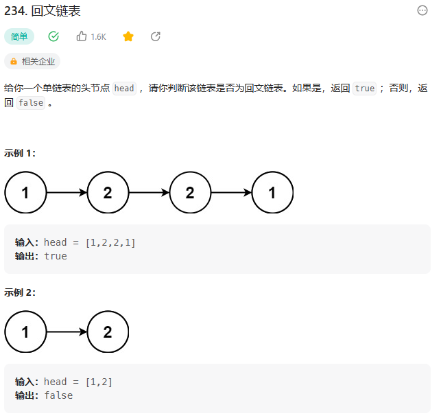

# 234. 回文链表


## 题目

  


## 思路

* 双指针算法，设置前后指针
* 将链表中所有的元素存入数组中，设置前后指针start,end 比较start和end指向的元素是否相等
* 如果相等 start++ end--,不相等直接返回false

## 代码

```java
/**
 * Definition for singly-linked list.
 * public class ListNode {
 *     int val;
 *     ListNode next;
 *     ListNode() {}
 *     ListNode(int val) { this.val = val; }
 *     ListNode(int val, ListNode next) { this.val = val; this.next = next; }
 * }
 */
class Solution {
    public boolean isPalindrome(ListNode head) {
        // 双指针算法  设置首尾指针 比较首尾指针指向的元素是否相等
        ListNode tail = head;
        int[] arr = new int[100001];// 将链表中的元素全部存入数组中

        // 将尾指针指向最后一个元素
        int end = 0;
        while(tail != null){
            arr[end] = tail.val;
            end++;// 最后比链表的长度大一
            tail = tail.next;
        }
        // 这里的end已经超过链表的长度了
        end = end - 1;

        int start = 0;
        while(start != end && start <= end)
        {
            if(arr[start] == arr[end]){
                start++;
                end--;
            }
            else{
                return false;
            }
        }

        if(start == end || start == end + 1)
        {
            return true;
        }

        return false;


    }
}

```
