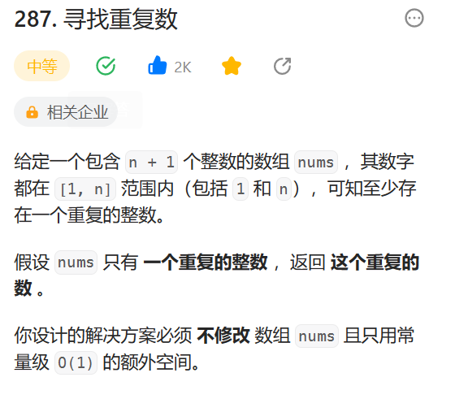

# 287. 寻找重复数

## 题目
  

## 思路
* 先将数组进行排序
* 然后使用双指针进行排序  前后指针指向的元素进行比较


## 代码

```java
class Solution {
    public int findDuplicate(int[] nums) {
        // 先将数组进行排序
        // 然后使用双指针 前后指针
        Arrays.sort(nums);// 排序

        int i = 0;
        int j = 1;

        while(j < nums.length){
            // 比较相邻两个数是不是一样
            if(nums[i] == nums[j]){
                return nums[i];
            }
            i++;
            j++;
        }

        return 0;


    }
}
```
