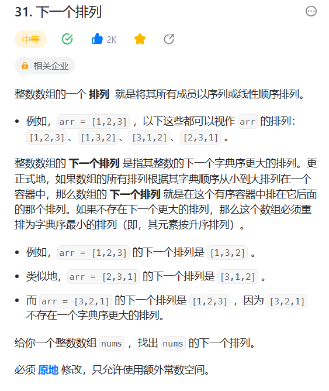
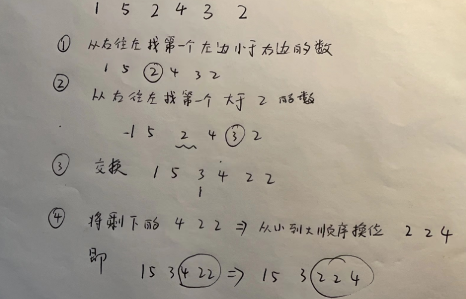

# 31. 下一个排列

## 题目
  


## 思路

  


## 代码

```java
class Solution {
    public void nextPermutation(int[] nums) {
        int i = nums.length - 2;// 从倒数第二个开始找
        // 从左往右寻找第一个左边i小于右边i + 1的数字
        while(i >= 0 && nums[i] >= nums[i + 1]){
            i--;
        }

        // 这里需要判断一下 i>= 0 一个是为了防止越界还有就是对于 3 2 1这种排列
        // 之后从右往左寻找第一个大于nums[i]的数字  然后与之进行交换
        if(i >= 0){
            int j = nums.length - 1;
            while(j >= 0 && nums[j] <= nums[i]){
                j--;
            }

            // 找到之后进行交换
            int temp = nums[i];
            nums[i] = nums[j];
            nums[j] = temp;
        }

        // 如果i = -1 说明是这种3 2 1形式
        // 前后数字进行交换
        int left = i + 1;
        int rigth = nums.length - 1;
        while(left < rigth){
            int t = nums[left];
            nums[left] = nums[rigth];
            nums[rigth] = t;
            left++;
            rigth--;
        }
    }
}

```

