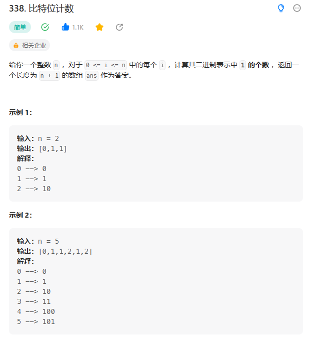
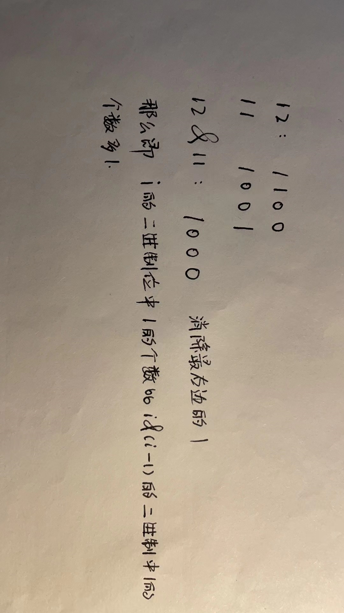

# 338. 比特位计数

## 题目

  


## 思路

* i & (i - 1)的结果是消除i的二进制最右边的1
* 那么我们初始化一个bits数组，初始化全部为0
* 那么bits[0] = 0,bits[1] = bits[0] + 1

  


## 代码

```java
class Solution {
    public int[] countBits(int n) {
        // 位运算 i & (i - 1)  消除二进制位中最右边的1
        int[] bits = new int[n + 1];

        // 当i大于0 的时候 i比特位数比 i & (i - 1) 多一个1
        // 那么初始化bits[0] = 0 计算Bits[1]
        for(int i = 1; i <= n; i++){
            bits[i] = bits[i & (i - 1)] + 1;
        }

        return bits;
    }
}

```
