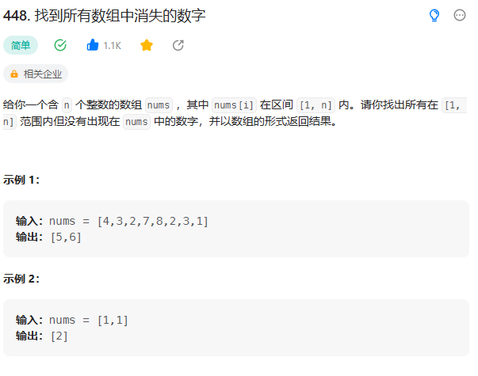

# 448. 找到所有数组中消失的数字

## 题目
  

## 思路

* 定义一个Map容器，将所有的key初始化为1~n 
* 对于nums数组中每一个元素nums[i],将其对应的map的value赋值为1
* 最后遍历map容器 出现一个value为0 将其填入list中


## 代码

```java
class Solution {
    public List<Integer> findDisappearedNumbers(int[] nums) {
        // 定义Map容器 每一种数字如果出现过那么就value = 1
        // 没有出现过 value = 0 最后找出所有value = 0的key
        HashMap<Integer,Integer> map = new HashMap<>();

        // 将容器的所有key初始化为1 -n
        for(int i = 1; i <= nums.length; i++){
            map.put(i,0);
        }

        // 遍历nums 查看每一种数字是不是出现过
        for(int i = 0; i < nums.length; i++){
            if(map.containsKey(nums[i])){
                map.put(nums[i],1);// 修改指定key的value
            }
        }

        List<Integer> l = new ArrayList<>();// 多态

        // 遍历容器
        // 找出value为0的元素
        // 获取map的所有key


        for(Integer key: map.keySet()){
            if(map.get(key) == 0){
                l.add(key);
            }
        }


        return l;
    }
}

```
