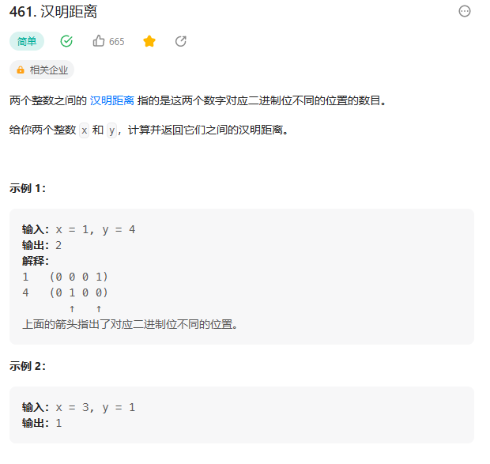

# 461. 汉明距离

## 题目
  


## 思路

* 每次取出最后一位，然后比较最后一位是否相同
* 然后将x和y进行右移一位
* x & 1 运算可以取出最后一位
* x >> 1 运算右移一位

## 代码

```java
class Solution {
    public int hammingDistance(int x, int y) {
        int count = 0;

        while((x | y) != 0){
            // 取出最后一位  统计是否相同  然后将x和y进行右移
            int a = x & 1,b = y & 1;// 取出最后一位
            count += a ^ b;// 异或运算 不同的加一
        
            x = x >> 1;
            y = y >> 1;
        }

        return count;
    }
}

```

