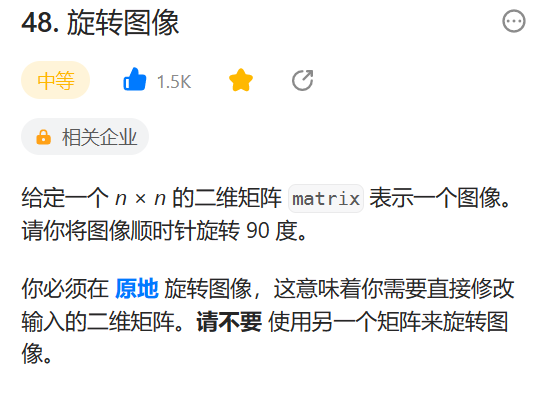
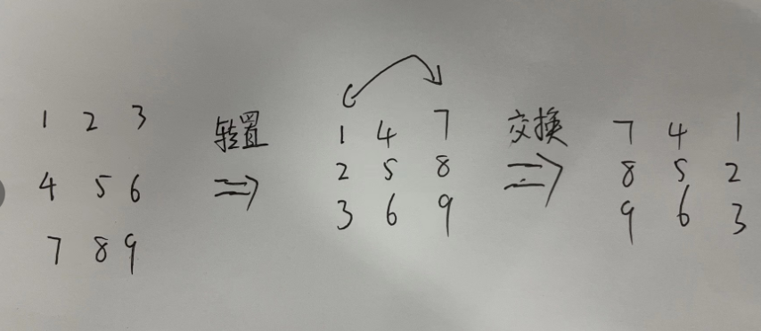

# 48. 旋转图像

## 题目
  


## 思路

* 先将矩阵进行转置
* 然后将矩阵左右两边元素进行交换

  


## 代码

```java
class Solution {
    public void rotate(int[][] matrix) {
        // 矩阵的转置  沿着对角线交换元素
        for(int i = 0; i < matrix.length; i++){
            for(int j = i + 1; j < matrix[0].length; j++)
            {
                int t = matrix[i][j];
                matrix[i][j] = matrix[j][i];
                matrix[j][i] = t;
            }
        }

        // 矩阵左右两边进行互换 行号下标都是不变的
        if(matrix[0].length % 2 == 0){
            // 矩阵的列数是偶数
            for(int ii = 0; ii < matrix.length; ii++){
                for(int k = 0; k < matrix[0].length / 2; k++){
                    // 交换数据
                    int temp = matrix[ii][k];
                    matrix[ii][k] = matrix[ii][matrix[0].length - 1 - k];
                    matrix[ii][matrix[0].length - 1 - k] = temp;
                }
            }
        }else{
            // 如果矩阵的列数是奇数
            for(int jj = 0; jj < matrix.length;jj++){
                for(int kk = 0; kk < matrix[0].length / 2; kk++){
                    int temp = matrix[jj][kk];
                    matrix[jj][kk] = matrix[jj][matrix[0].length - 1 - kk];
                    matrix[jj][matrix[0].length - 1 - kk] = temp;
                }
            }
        }
    }
}

```
