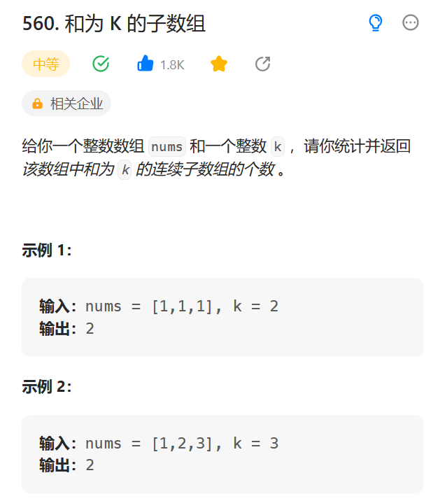

# 560. 和为 K 的子数组

## 题目

  


## 思路

* 使用双重循环
* 外层循环i遍历数组中的每一个元素
* 内存循环j从i开始遍历剩下的数组元素
* 对于每一个数组元素使用sum 进行求和 然后判断sum 与k 是不是相等，是的话count++;

## 代码

```java
class Solution {
    public int subarraySum(int[] nums, int k) {
        // Arrays.sort(nums);
        // 暴力解法  定一移二
        int count = 0;
        int res = 0;
        // 遍历数组中的每一个元素
        for(int i = 0; i < nums.length;i++){
            int sum = 0;
            for(int j = i; j < nums.length; j++){
                sum += nums[j];
                if(sum == k){
                    count++;
                }
            }
            
        }
        return count;
    }
}

```
