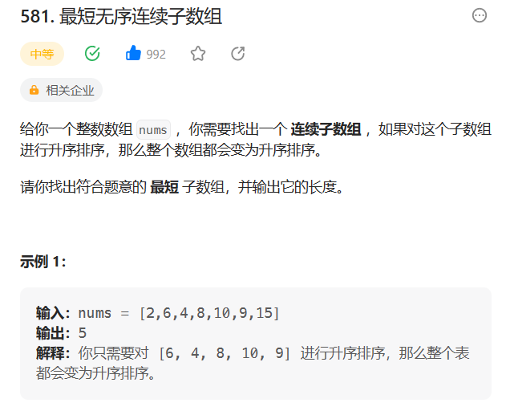

# 581. 最短无序连续子数组

## 题目
  


## 思路

* 先创建一个数组 复制原数组
* 将原数组进行排序
* 从头开始遍历原数组，比较原数组元素和排序之后的数组元素是不是一样，不一样记录位置start
* 从后面开始遍历原数组，比较原数组元素和排序之后的数组元素是不是一样，不一样记录位置end
* 最后返回end - start + 1

## 代码

```java
class Solution {
    public int findUnsortedSubarray(int[] nums) {
        int[] nums1 = new int[nums.length];

        for(int i = 0; i < nums.length; i++){
            nums1[i] = nums[i];
        }

        // 先将数组整体进行排序
        Arrays.sort(nums);

        int start = 0;
        int end = 0;

        // 比较两个数组  前后开始比较  找出第一个不同的地方
        for(int i = 0; i < nums.length; i++){
            if(nums[i] == nums1[i]){
                continue;
            }else{
                start = i;
                break;
            }
        }

        // 从后面往前面找 第一个不同的地方
        for(int j = nums.length - 1; j >= 0; j--){
            if(nums[j] == nums1[j]){
                continue;
            }else{
                end = j;
                break;
            }
        }

        if(end - start == 0){
            return 0;
        }

        return end - start + 1 ;
    }
}

```

