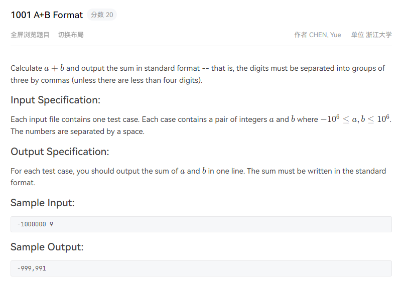
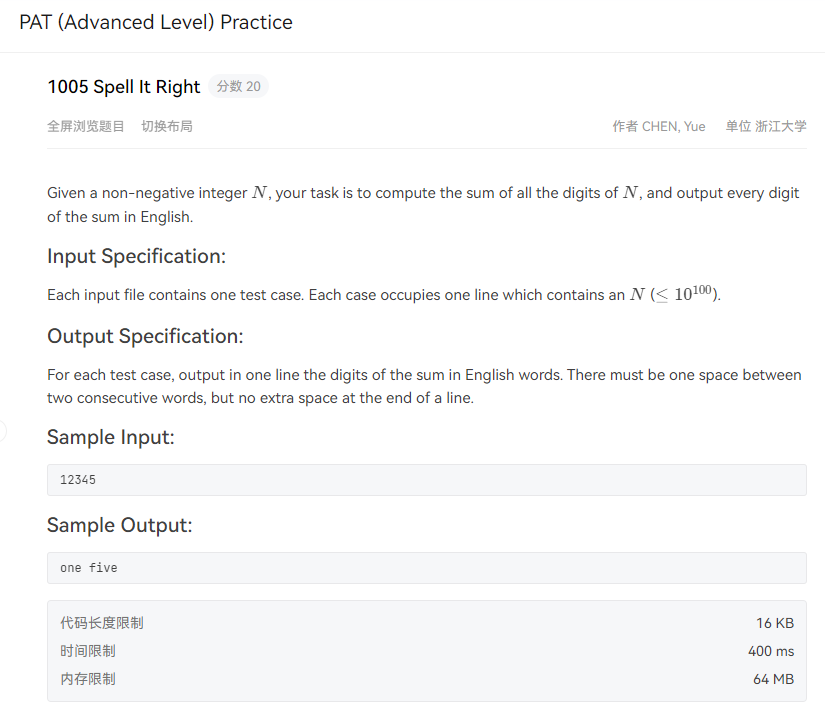

# 字符串处理

## 1001 A+B Format

  

思路：

&emsp; 先将数字转换成字符串，然后遍历字符串，每遍历一个数字将该数字存入一个新的字符串（字符串拼接），每三个字符就打上一个逗号（注意-99999这种，当i=0时不需要打上逗号，因为此时是负号，以及num[i-1] = '-'此时也不需要添加逗号，因为下一个就是负号）

```cpp
#include<iostream>
using namespace std;

int main()
{
    int a,b;
    cin>>a>>b;
    int c = a + b;
    string num = to_string(c); //将结果转换为字符串
    string res;
    
    // 遍历字符串 
    for(int i = num.size() - 1,j = 0; i >= 0; i--)
    {
        // 字符串的拼接
        res = num[i] + res;//注意拼接顺序
        j++;
        if(j % 3 == 0 &&i!=0&& num[i - 1] != '-')
        {
            res = ',' + res;// 添加一个逗号
        }
    }
    cout<<res;
    return 0;
}

```

学到的东西：数字转化成字符串API，以及边界值处理方法


## 1005 Spell It Right

  

思路：首先由于数据量过于庞大，那么一定要输入一个字符串，那么遍历该字符串，取出每一个字符，将每一个字符转化成数字（减去字符0），然后求和，将求和之后的数字转化成字符串，遍历字符串，输出每一个数字对应的英文单词。

```cpp
#include<iostream>
using namespace std;

int main()
{
    string n;
    cin>>n;
    
    int s = 0;
    for(auto c:n) s += c - '0';
    
    string str = to_string(s);
    
    char word[10][10] = {
        "zero","one","two","three","four",
        "five","six","seven","eight","nine",
    };
    
    // 输出第一个字母
    cout<<word[str[0] - '0'];
    
    for(int i = 1; i < str.size(); i++)
    {
        cout<<' '<<word[str[i] - '0'];
    }
    
    return 0;   
}
```


