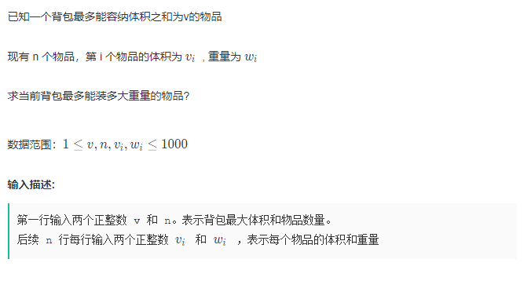
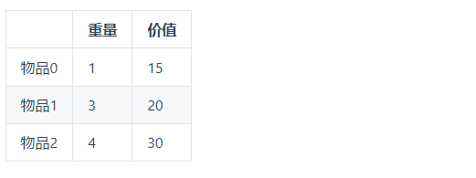
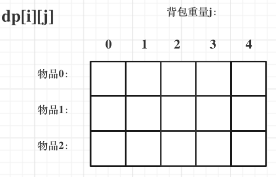

# 01背包学习笔记-二维dp数组问题

参考代码随想录：```https://programmercarl.com/%E8%83%8C%E5%8C%85%E7%90%86%E8%AE%BA%E5%9F%BA%E7%A1%8001%E8%83%8C%E5%8C%85-1.html#%E4%BA%8C%E7%BB%B4dp%E6%95%B0%E7%BB%8401%E8%83%8C%E5%8C%85```

## 一、问题描述

  

## 二、案例讲解

  

### 2.1 确定dp数组以及下标的含义

&emsp;对于背包问题，可以使用二维数组进行求解，dp[i][j]代表从下标[0-i]的物品里任意选取，放进容量为j的背包中，价值总和最大是多少？

**可以理解为，你现在有一个书包，可以装得下j重量的物品，现在有0-i个物品让你选取（但是每一种物品只有一个），使得最后获取价值总和最大**

  

### 2.2 确定递推公式

这里dp[i][j]的状态就是：**已经选取i - 1个物品，在选取第i个物品所获得的最大价值是多少，那么该状态是由两种状态推断出，一种是不放物品i（物品i放不进去了）,另一种是放物品i(物品i放的进去)**

* 不放物品i（**就是物品i放不进去了**）
  **由dp[i - 1][j]推断出，也就是背包的容量是j,里面有i - 1个物品，那么计算此时的最大价值**

  **通俗的讲，就是物品i放不进去了，那么现在你得书包还有i - 1个物品，此时的最大价值就是dp[i - 1][j],也可以这么想：不放物品i ,前面i - 1个物品占据了容量为j的背包**

* 放物品i(**物品i放的进去**)

  **由dp[i - 1][weight]推断出，dp[i - 1][j - weight[i]]是背包容量为j - weight[i]的时候不放物品I的最大价值（可以这么理解，背包的容量还是j,那么我把物品I放进去之后，原来的i - 1个物品只能占用j - weight[i]的容量了！！！），那么dp[i - 1][j - weight[i]] + value[i]（物品I的价值），就是背包放物品i得到的最大价值**

  **通俗的来说，你有一个书包，书包的容量是j,你现在要把物品I放进去，整个物品集被分为两个部分，前i- 1个物品，和第i个物品，原先i - 1个物品占用的是容量为j的书包，但是现在第i个物品来了之后，原先i - 1个物品只能占用j - weight[i]的容量，并且使其最大化，再加上value[i]就是dpij**


递推公式：```dp[i][j] = max(dp[i - 1][j],dp[i - 1][j - weight[i]] + value[i])```

### 2.3 初始化dp数组

&emsp;**我们看这个地推公式，可以发现，dp[i][j]是由两部分得出的，其中dp[i - 1][j]从图中上方一个格子得出的，dp[i - 1][j - weight[i]]是从左上方一个格子得出的**

  

所以，我们初始化的是由一定要先初始化第一行和第一列，不然的话中间那些格子就没办法得出结果。

对于第一列，背包的容量是0，那么什么东西都放不下，第一列价值全部初始化为0，对于第一行，物品0的重量是1，那么所有背包都可以满足物品0，那就全部初始化为物品0的价值15

```cpp

for(int j =0; j < weight[0]; j++)
{
    dp[0][j] = 0;// 所有元素都初始化为0
}

// 第一行元素初始化
for(int j = weight[0]; j <= bagWeight; j++)
{
    dp[0][j] = value[0];
}

```

**那么，其余那些元素该如何初始化，由于dp[i][j]是由上方元素和左上方元素推到得到的，所以初始化为任何值即可，因为都会被覆盖**

那么，最后的初始化dp数组的代码如下：


```cpp

vector<vector<int>> dp(weight.size(),vector<int>(bagWeight + 1,0));

for(int j = weigth[0]; j <= bagWeight; j++)
{
    dp[0][j] = value[0];
}

```

### 2.4 确定遍历顺序

* 先遍历物品在遍历背包重量：
  ```cpp
  // 外层循环遍历物品
  for(int i = 1; i < weight.size(); i++)
  {
    for(int j = 0; j <= bagWeight; j++)
    {
        // 状态转移方程
        if(j < weight[i])
        {
            dp[i][j] = dp[i - 1][j];
        }
        else
        {
            dp[i][j] = max(dp[i - 1][j],dp[i - 1][j - weight[i] + value[i]]);
        }
    }
  }
  ```

### 2.5 完整版的代码

```cpp

void func()
{
    vector<int> weight = {1,3,4};
    vector<int> value = {15,20,30};
    int bagWeight = 4;// 背包的最大容量

    // 二维数组  先全部初始化为0
    // weight.size() 就是物品的个数
    // 对于每一行元素 全部初始为0 
    vector<vector<int>> dp(weight.size() + 1,vector<int>(bagWeight + 1,0));

    // 初始化  第一行元素初始化为第一个物品的价值
    for(int j = weight[0]; j <= bagWeight; j++)
    {
        dp[0][j] = value[0];
    }

    for(int i = 1; i < weight.size(); i++)
    {
        for(int j = 0; j <= bagWeight;j++)
        {
            if(j < weight[i])
            {
                dp[i][j] = dp[i -1][j];
            }
            else
            {
                dp[i][j] = max(dp[i - 1][j],dp[i - 1][j - weight[i]] + value[i]);
            }
        }
    }

    cout<<dp[weight.size() - 1][bagWeight]<<endl;

}


```

