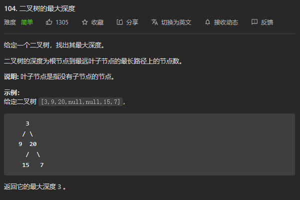

# 104. 二叉树的最大深度

## 题目

  

## 思路

* 确定递归函数的参数和返回值，参数就是二叉树的根节点，返回值就是树的深度
* 递归出口，空结点，返回0
* 确定单层递归逻辑：先求左子树的深度，再求右子树的深度，然后取深度最大值加一，就是当前节点的最大深度

## 代码

```cpp
/**
 * Definition for a binary tree node.
 * struct TreeNode {
 *     int val;
 *     TreeNode *left;
 *     TreeNode *right;
 *     TreeNode() : val(0), left(nullptr), right(nullptr) {}
 *     TreeNode(int x) : val(x), left(nullptr), right(nullptr) {}
 *     TreeNode(int x, TreeNode *left, TreeNode *right) : val(x), left(left), right(right) {}
 * };
 */
class Solution {
public:
    int getDepth(TreeNode* root)
    {
        if(root == NULL)
        {
            return 0;// 递归出口
        }
        int leftDepth = getDepth(root->left);
        int rightDepth = getDepth(root->right);
        int depth = max(leftDepth,rightDepth) + 1;
        return depth;
    }

    int maxDepth(TreeNode* root) {
        return getDepth(root);
    }
};

```

