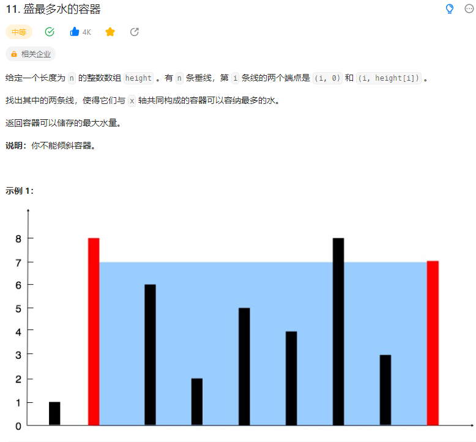
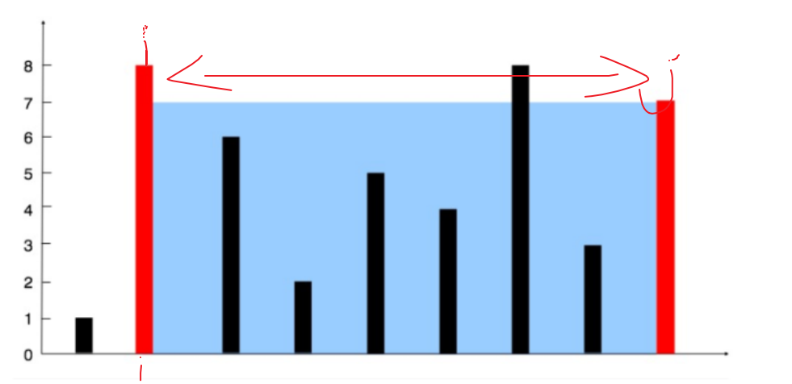

# 11. 盛最多水的容器

## 题目
  


## 思路

* 双指针：设置前后指针
* 矩形的面积在于两个height元素之间的距离还有height[i]与height[j]之间的最小值
* 设置前后指针，计算前后指针之间的矩形面积，然后比较前后指针的height元素大小，就是高度，将高度小的指针进行移动，寻找更大的高度（因为指针一移动，中间的距离就变小了，所以要寻找高度大的）


  


## 代码

```java
class Solution {
    public int maxArea(int[] height) {
        int left = 0;
        int right = height.length - 1;
        int area = 0;
        int cur;

        // 前后指针
        while(left < right)
        {
            if(height[left] <= height[right]){
                cur = (right - left) * height[left];// 计算当前的面积
            }
            else{
                cur = (right - left) * height[right];// 计算当前的面积
            }

            area = cur > area ? cur : area;

            // 指针移动的目的是寻找更大的height[i]
            if(height[left] < height[right]){
                left++;
            }else{
                right--;
            }
        }

        return area;
    }
}
```

