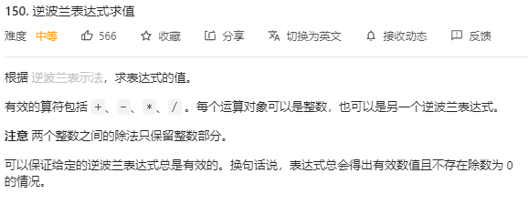

# 150. 逆波兰表达式求值

## 题目
  

## 思路

* 扫描后缀表达式，遇到数字就将其入栈
* 当扫描到运算符时，将栈顶的两个元素取出来进行运算，然后将结果存入栈中

## 代码

```cpp
class Solution {
public:
    int evalRPN(vector<string>& tokens) {
        stack<int> st;

        for(int i = 0; i < tokens.size(); i++)
        {
            if(tokens[i] == "+" || tokens[i] == "-" || tokens[i] == "*" || tokens[i] == "/")
            {
                // 遇到运算符 取出两个栈顶元素进行运算 将结果放回栈中
                int num1 = st.top();// 取出栈顶元素
                st.pop();// 出栈
                int num2 = st.top();
                st.pop();
                if(tokens[i] == "+") st.push(num1 + num2);
                if(tokens[i] == "-") st.push(num2 - num1);
                if(tokens[i] == "*") st.push(num1 * num2);
                if(tokens[i] == "/") st.push(num2 / num1);
            }
            else
            {
                st.push(stoi(tokens[i]));
            }
        }
        int result = st.top();
        st.pop();// 把栈里最后一个元素弹出 
        return result;
    }
};

```
