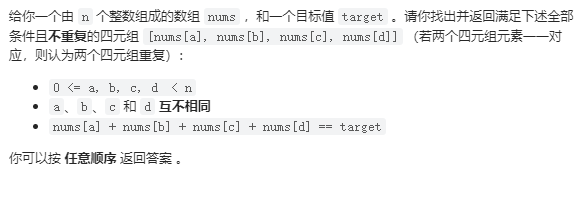

# 18. 四数之和

## 题目

  


## 思路

&emsp;四数之和的双指针解法是两层for循环遍历，得到的nums[k] + nums[i]为确定值，依然是left和right下标作为双指针，找出nums[k] + nums[i] + nums[right] + nums[left] == target 的情况，事件复杂度On3


## 代码

```cpp
class Solution {
public:
    vector<vector<int>> fourSum(vector<int>& nums, int target) {
        vector<vector<int>> result;
        sort(nums.begin(), nums.end());
        for (int k = 0; k < nums.size(); k++) {
	    // 剪枝处理
            if (nums[k] > target && (nums[k] >= 0 || target >= 0)) {
            	break; // 这里使用break，统一通过最后的return返回
            }
            // 去重
            if (k > 0 && nums[k] == nums[k - 1]) {
                continue;
            }
            for (int i = k + 1; i < nums.size(); i++) {
	    	// 2级剪枝处理
		if (nums[k] + nums[i] > target && (nums[k] + nums[i] >= 0 || target >= 0)) {
		    break;
		}
		
                // 正确去重方法
                if (i > k + 1 && nums[i] == nums[i - 1]) {
                    continue;
                }
                int left = i + 1;
                int right = nums.size() - 1;
                while (right > left) {
                    // nums[k] + nums[i] + nums[left] + nums[right] > target 会溢出
                    if (nums[k] + nums[i] > target - (nums[left] + nums[right])) {
                        right--;
                        // 当前元素不合适了，可以去重
                        while (left < right && nums[right] == nums[right + 1]) right--;
                    // nums[k] + nums[i] + nums[left] + nums[right] < target 会溢出
                    } else if (nums[k] + nums[i]  < target - (nums[left] + nums[right])) {
                        left++;
                        // 不合适，去重
                        while (left < right && nums[left] == nums[left - 1]) left++;
                    } else {
                        result.push_back(vector<int>{nums[k], nums[i], nums[left], nums[right]});
                        // 去重逻辑应该放在找到一个四元组之后
                        while (right > left && nums[right] == nums[right - 1]) right--;
                        while (right > left && nums[left] == nums[left + 1]) left++;

                        // 找到答案时，双指针同时收缩
                        right--;
                        left++;
                    }
                }

            }
        }
        return result;
    }
};

```

