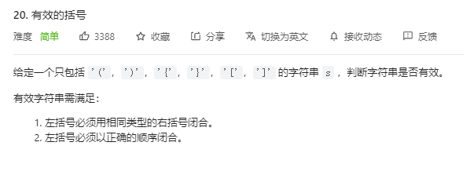

# 20. 有效的括号

## 题目
  


## 思路

&emsp;首先遍历完所有的左括号，将每一个左括号对应的右括号全部入栈，然后比较当前s[i]和栈顶的右括号是否相同即可。

## 代码

```cpp
class Solution {
public:
    bool isValid(string s) {
        stack<int> st;
        for(int i = 0; i < s.size(); i++)
        {
            // 匹配左括号的时候 右括号先入栈  等左括号全部遍历完毕之后，就只需要比较当前元素和栈顶是否相等就可以
            if(s[i] == '(')
            {
                st.push(')');
            }
            else if(s[i] == '{')
            {
                st.push('}');
            }
            else if(s[i] == '[')
            {
                st.push(']');
            }
            else if(st.empty() == true || st.top() != s[i])
            {
                // 走到这里 说明栈中没有字符了 或者s[i]是右括号 那么直接返回错误
                return false;
            }
            else
            {
                st.pop();// st.top() 与 s[i]相等 栈弹出元素
            }
        }

       // 看一下栈是不是空 不为空 说明还有左括号没有被匹配
       return st.empty();
    }
};

```
