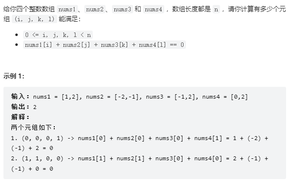

# 454. 四数相加 II

## 题目

  


## 思路

* 首先定义一个unordered_map,key防止a和b两数之和，value放置a和b两数之和出现的次数
* 遍历nums1和nums2两个数组，统计a + b出现的次数
* 定义变量count,统计a + b + c + d出现的次数
* 遍历nums3和nums4数组，找到如果0 - （c + d）在map出现过的话，就用count把map中Key对应的value也就是a + b出现的次数统计出来
* 返回count 

## 代码

```cpp
class Solution {
public:
    int fourSumCount(vector<int>& nums1, vector<int>& nums2, vector<int>& nums3, vector<int>& nums4) {
        unordered_map<int,int> umap;// key:  a+ b的数值  value: a+b出现的次数

        // 遍历A B数组  统计两个数组元素之和 以及出现的次数，将其存储到map中
        for(int a : nums1)
        {
            for(int b: nums2)
            {
                umap[a + b]++;// a + b的次数++
            }
        }
        
        int count = 0;

        // 遍历大C和大D数组 找到如果0 - (c + d)在Map中出现过的话 就把map中Key对应的value(a + b出现的次数)与count求和
        for(int c : nums3){
            for(int d:nums4){
                if(umap.find(0 - (c + d)) != umap.end()){
                    count += umap[0 - (c + d)];// 次数加一
                }
            }
        }

        return count;
    }
};
```

