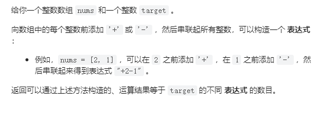

# 494. 目标和

## 题目
  


## 思路

* 需要组合这个数组中所有数字 实现target 一定有 left - right = target
* 又因为left + right = sum  所以right = sum - left
* left - （sum - left） = target  left = (sum + target) / 2
* 定义dp数组 以及他的含义
* 全部初始化为0  dp[j]表示容量为j装满有几种方法  不是背包中物品的最大价值
* 状态转移方程  先遍历物品  在遍历背包容量
* 每一种物品放进不同容量的背包中
* 每次遍历一种物品 dp数组就更新一次 正向填充dp数组  容量大的背包计算方法是由容量小的背包计算方法填充进去的

## 代码

```cpp
class Solution {
public:
    int findTargetSumWays(vector<int>& nums, int target) {
        // 需要组合这个数组中所有数字 实现target 一定有 left - right = target
        // 又因为left + right = sum  所以right = sum - left
        // left - （sum - left） = target  left = (sum + target) / 2

        // 模板题
        // 那么01背包问题求解的目标和就是这里的Left
        int sum = 0;
        for(int i = 0; i < nums.size(); i++)
        {
            sum += nums[i];
        }
        // 计算left是否是非整数
        if((sum + target) %2 == 1)
        {
            return 0;// 表示没有构造方法
        }

        if(abs(target) > sum)
        {
            return 0;
        }

        int left = (sum + target) / 2;// 计算dp数组的目标
        // 定义dp数组 以及他的含义
        // 全部初始化为0  dp[j]表示容量为j装满有几种方法  不是背包中物品的最大价值
        vector<int> dp(left + 1,0);
        dp[0] = 1;// 容量为0的背包 装满 只有一种方法：0件物品

        // 状态转移方程  先遍历物品  在遍历背包容量
        // 每一种物品放进不同容量的背包中
        // 每次遍历一种物品 dp数组就更新一次 正向填充dp数组  容量大的背包计算方法是由容量小的背包计算方法填充进去的
        for(int i = 0; i < nums.size(); i++)
        {
            for(int j = left; j >= nums[i]; j--)
            {
                dp[j] = dp[j] + dp[j - nums[i]];
            }
        }
        return dp[left];
    }
};

```

