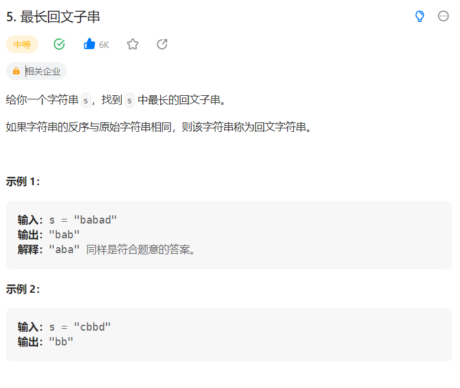

# 5. 最长回文子串

## 题目
  


## 思路

* 使用双指针算法
* 回文串的判断使用中心扩散法，对于每一个元素，比较左右两边的元素是否相等，如果相等，截取左右指针之间的字符串，然后左右两边的指针开始移动
* 返回截取的回文字符串
* 主函数开始遍历每一个元素，回文串有奇数个字符或者偶数个字符，那么双指针i,j一开始的位置是一个中心元素或者两个中心元素，计算以每一个字符或者两个字符为中心元素所得到的回文字符串


## 代码

```java
class Solution {
    public String longestPalindrome(String s) {
        String a = "";
        String b = "";
        String c = "";

        for(int i = 0; i < s.length(); i++){
            a = huiwen(s,i,i);// 单个元素为中心点
            c = a.length() > c.length() ? a:c;
            b = huiwen(s,i,i+1);
            c = b.length() > c.length() ? b:c;
        }

        return c;
    }

    // 双指针 中心扩散法
    public String huiwen(String s,int start,int end){
        String tmp = "";

        while(start >= 0 && end < s.length() && s.charAt(start) == s.charAt(end)){
            // 如果首尾指针的字符相等 直接截取
            tmp = s.substring(start,end + 1);
            start--;
            end++;
        }

        return tmp;
    }
}

```

