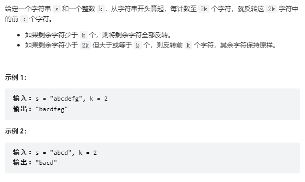

# 541. 反转字符串 II

## 题目
  

## 思路
* 每隔K个字符就翻转前K个字符，剩余不够k个字符  全部进行翻转


## 代码

```cpp
class Solution {
public:
    string reverseStr(string s, int k) {
        for(int i = 0; i < s.size(); i += (2 * k))
        {
            // 每隔K个字符就翻转前K个字符，剩余不够k个字符  全部进行翻转
            // 说明剩余的字符大于或者等于k个
            if(i + k <= s.size())
            {
                // 翻转前k个字符
                reverse(s.begin() + i,s.begin() + i + k);
                continue;
            }

            // 如果剩余字符少于k个  全部翻转
            reverse(s.begin() + i,s.begin() + s.size());
        }

        return s;
    }
};

```
