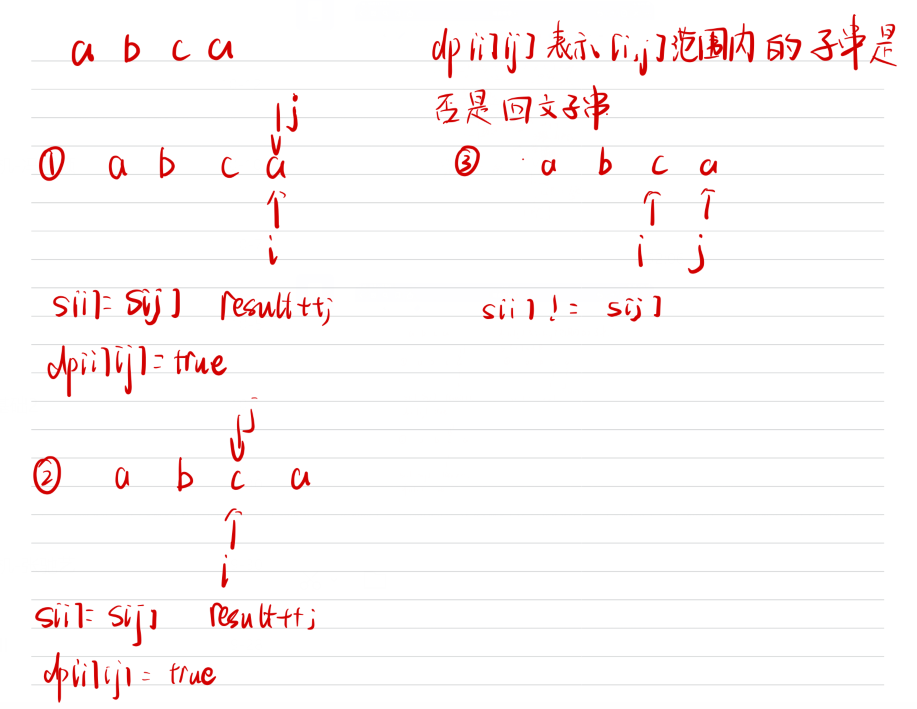

# 647. 回文子串

## 题目

给你一个字符串 s ，请你统计并返回这个字符串中 回文子串 的数目。

回文字符串 是正着读和倒过来读一样的字符串。

子字符串 是字符串中的由连续字符组成的一个序列。

具有不同开始位置或结束位置的子串，即使是由相同的字符组成，也会被视作不同的子串。

## 思路

* dp[i][j]代表区间范围[i,j]字符串是不是回文子串
* 如果s[i] = s[j]那么 判断j 和 i相差多少，如果j = i 那么一个字符一定是回文子串 如果相差一，比如aa 也是回文子串
* 如果相差大于1 比如acba 那么判断dp[i + 1][j - 1]是不是回文子串，如果是 那么dp[i][j]赋值为true
* 我们使用result统计回文字串的数量

  


## 代码

```cpp
class Solution {
public:
    int countSubstrings(string s) {
        vector<vector<bool>> dp(s.size(),vector<bool>(s.size(),false));
        int result = 0;// 统计回文子串的数量

        for(int i = s.size() - 1; i >= 0; i--)
        {
            // 遍历顺序是先下后上  从左往右
            for(int j = i; j < s.size(); j++)
            {
                if(s[i] == s[j])
                {
                    if(j - i <= 1)
                    {
                        result++;
                        dp[i][j] = true;
                    }
                    else if(dp[i + 1][j - 1] == true)
                    {
                        result++;
                        dp[i][j] = true;
                    }
                }
            }
        }

        return result;

    }
};

```