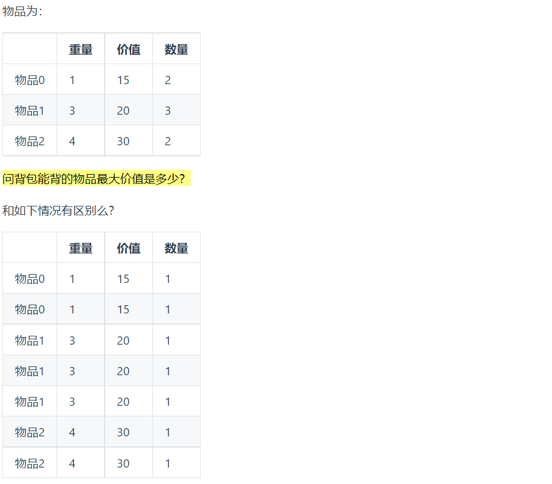

# 多重背包理论基础

## 一、概述


&emsp;有N种物品和一个容量为V的背包，第I种物品最多有Mi件可用，每件耗费的空间是Ci,价值是Wi,求解将哪些物品装入背包可以使这些物品的耗费的空间总和不超过背包的容量，且价值总和最大

每件物品最多有Mi件可用，将Mi件摊开，其实就是01背包问题

  

这样一来，就变成了01背包问题，每个物品只用一次

## 二、代码实现

```cpp

void multi_pack(){
    vector<int> weight = {1,3,4};
    vector<int> value = {15,20,30};
    vector<int> nums = {2,3,2};
    int bagWeight = 10;// 背包容量

    // 将每件物品进行展开
    for(int i = 0; i < nums.size(); i++)
    {
        while(nums[i] > 1)
        {
            weight.push_back(weight[i]);
            value.push_back(value[i]);
            nums[i]--;
        }
    }

    // 初始化dp数组
    vector<int> dp(bagWeight + 1,0);

    for(int i = 0; i < weight.size(); i++)
    {
        // 先遍历物品 在遍历背包  背包倒序遍历
        for(int j = bagWeight; j >= weight[i]; j--)
        {
            dp[j] = max(dp[j],dp[j - weight[i]] + value[i]);
        }
    }


    cout<<dp[bagWeight]<<endl;
}


```

