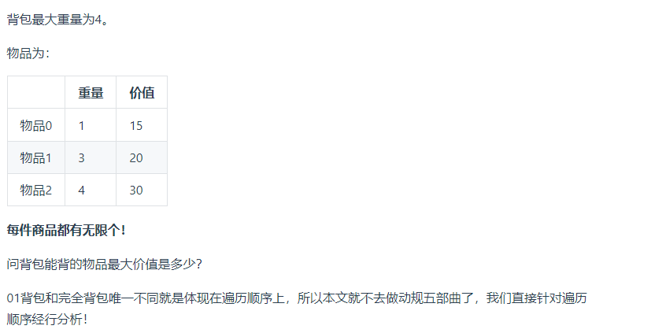
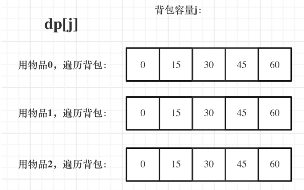

# 完全背包理论基础笔记

## 一、概述

&emsp;有N件物品何一个最多能背重量为W的背包，第i件物品的重量是weight[i],得到的价值是value[i].每件物品都有无限个（也就是可以放入背包多次），求解将那些物品装入背包里物品价值总和最大。

**完全背包和01背包不同点在于每件物品有无限件**

  

**01背包和完全背包唯一不同的就是体现在遍历顺序上**，回顾一下01背包的核心代码：

```cpp

for(int i = 0; i < weight; i++)
{

    //遍历物品
    // 遍历背包
    for(int j = bagWeight; j >= weight[i]; j--)
    {
        // 遍历背包容量
        dp[j] = max(dp[j],dp[j - weight[i]] + value[i]);
    }
}
```

01背包问题内嵌的循环是从大到小遍历，为了保证每一种物品被添加一次。

**但是完全背包的物品是可以被多次添加的，所以需要从小到大进行遍历**
```cpp
// 先遍历物品
for(int i = 0; i < weight.size(); i++)
{
    for(int j = weight[i]; j <= bagWeight; j++)
    {
        // 遍历背包容量
        dp[j] = max(dp[j],dp[j - weight[i]] + value[i]);
    }
}

```

  


**完全背包问题中，先遍历物品在遍历背包还是反过来顺序，都是不影响dp[j]计算的**

## 二、测试代码

```cpp
// 先遍历物品 在遍历背包
void test_CompletePack(){
    vector<int> weight = {1,3,4};
    vector<int> value = {15,20,30};

    int bagWeight = 4;

    vector<int> dp(bagWeight + 1,0);

    for(int i = 0; i < weight.szie(); i++)
    {
        // 遍历物品
        for(int j = value[i]; j <= bagWeight; j++)
        {
            // 遍历背包容量
            dp[j] = max(dp[j],dp[j - weight[i]] + value[i]);
        }
    }

    cout<<dp[bagWeight]<<endl;


}


```

