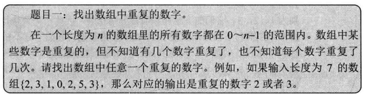
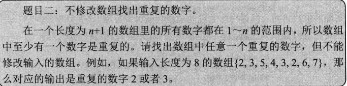
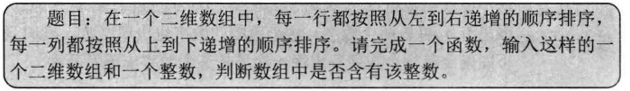

# 2.3 剑指offer-数据结构之数组学习笔记

## 一、数组

* 创建数组需要指定数组的容量大小，然后根据大小分配内存
* 数组的空间效率不是很好
* 数组的内存是连续的，可以实现随机存取。
* 用数组来实现简单的哈希表：把数组的下标设置成哈希表的键值（Key）,而把数组中的每一个数字设置成哈希表的值。

&emsp;关于STL的动态数组：vector每次扩充容量时，新的容量都是之前的两倍，将之前的数据复制到新的数组中，再把之前的内存释放，这样就可以减少内存的浪费。但是每一次扩充数组的容量都有大量的额外操作。

&emsp;在C/C++中，数组和指针既是相互关联又有区别的两个概念，声明一个数组，数组的名字也是一个指针，该指针指向数组的第一个元素。

数组与指针的区别：

```cpp
int GetSize(int data[])
{
    return sizeof(data);
}

int_tmain(int argc,_TCHAR* argv[])
{
    int data1[] = {1,2,3,4,5};
    int size1 = sizeof(data1);

    int *data2 = data1;
    int size2 = sizeof(data2);

    int size3 = GetSize(data1);
    printf("%d %d %d",size1,size2,size3);
}
```

输出：20，4，4.

&emsp;data1是一个数组，sizeof(data1)是求数组的大小。这个数组包含5个整数，每一个整数占4个字节，因此占用20个字节。data2声明为指针，尽管它指向了数组data1的第一个数字，但是他的本质仍然是一个指针。在32位系统上，对任意指针求sizeof,得到的都是4。当数组作为函数的参数进行传递时，数组就自动退化成同类型的指针。因此，尽管函数GetSize的参数data被声明为数组，但是他会退化成指针。

## 二、面试题：数组中的重复数字

  

### 1. 第一种实现方法-排序然后查找

&emsp;先将输入的数组排序，然后从排序的数组中找出一个重复的数组是一件很容易的事情，只需要从头到尾扫描排序之后的数组即可，这里使用快速排序，事件复杂度O(nlogn)

```cpp
class Solution {
public:
    int findRepeatNumber(vector<int>& nums) {
        sort(nums.begin(),nums.end());// 先排序
        // 之后遍历数组 查找重复数字 一个即可
        int x;
        for(int i = 0; i < nums.size(); i++)
        {
            if(nums[i] == nums[i + 1])
            {
                x = nums[i];
                break;
            }
        }
        return x;
    }
};
```

### 2. 哈希表

&emsp;从头到尾按照顺序扫描数组的每一个数字，每扫描到一个数字的时候，都可以用o(1)的时间来判断哈希表里是否包含了该数字。如果哈希表里还没有这个数字，就把他加入哈希表。如果哈希表已经存在该数字，就找到一个重复的数字。这个算法的时间复杂度是O(n),但是提高时间效率是以一个大小为O(n)的哈希表为代价的。

那么，当查到一个数字之后直接返回。

算法流程：
* 初始化：新建一个HashSet,记作map
* 遍历数组nums中的每一个数字nums[i]
* 将每一个nums[i]添加到map中，之后判断哈希表中nums[i]的个数，如果大于1 说明是重复元素。

```cpp
class Solution {
public:
    int findRepeatNumber(vector<int>& nums) {
        unordered_map<int,int>map;// 声明一个哈希数组
        for(int i = 0; i < nums.size(); i++)
        {
            map[nums[i]]++;// 将每一个数组元素都存入哈希表
            if(map[nums[i]] >= 2)
            {
                return nums[i];// 如果nums[i]不止一个 return
            }
        }
        return nums[nums.size() - 1];
    }
};

```

### 3. 原地交换方法

算法流程：

* 首先从头到尾扫描数组中的每一个数字，当扫描到下标i的数字时，首先比较这个数字是不是等于i,如果是，则接着扫描下一个数字；如果不是，那么拿nums[i]与nums[nums[i]]进行比较，如果他们相等，那就说明找到了一个重复的数字,如果他们不相等，那么就把第i个数字和第nums[i]个数字进行交换，**将nums[i]放到属于他的位置**。接下来重复进行比较，直到我们发现一个重复的数字。

&emsp;遍历中，第一次遇到数字x,将其交换至索引x;而当第二次遇到数字x,一定有nums[x] = x; 这就代表遇到了重复数字。


```cpp
class Solution {
public:
    int findRepeatNumber(vector<int>& nums) {
    int i = 0;
     while(i < nums.size())
      {
          if(nums[i] == i)
          {
              i++;
              continue;// 如果nums[i] = i 说明 该数字已经在对应的索引位置 不需要交换 直接跳过
          }
          if(nums[nums[i]] != nums[i])
          {
              // 进行原地交换
              swap(nums[i],nums[nums[i]]);
          }
          else
          {
              return nums[i];// 说明找到重复数字
          }
      }
      return -1;
    }
};
```


## 三、题目二：不修改数组找出重复的数字

  

&emsp;我们把从1~n的数字从中间的数字m分为两部分，前面一半为1-m,后面一半是m+1-n,如果1-m的数字超过了m，那么这一半的区间内一定包含重复的数字；否则另外一半m+1-n的区间里面一定包含重复的数字。我们可以继续把重复数字的区间一分为二，直到找到一个重复的数字。**这其实就是二分法的使用，只不过多了统计数字的步骤！！！**


```cpp
class Solution {
public:
    int duplicateInArray(vector<int>& nums) {
        int left = 1;
        int right = nums.size() - 1;// 长度是n+1的数组
        // left - right = 1-n
        while(left < right)
        {
            int mid = left + (right - left) / 2;
            int count = 0;
            // 统计左半边的数字个数
            for(int i = 0; i < nums.size(); i++)
            {
                if(nums[i] >= left && nums[i] <= mid)
                {
                    count++;
                }
            }
            // 左边的数字个数 大于区间长度 说明重复数字在左边
            if(count > mid - left + 1)
            {
                right = mid;// 将right 指定为mid 
            }
            else
            {
                // 重复数字在右半边
                left = mid + 1;
            }
        }
        return left;
    }
};

```


## 四、面试题四：二维数组的查找

  

算法流程：首先选取数组右上角的数字，如果该数字等于要查找的数字，则查找过程结束。如果该数字大于要查找的数字，那么剔除该数字所在的列；如果该数字小于要查找的数字，则剔除这个数字所在的行，也就是我们每次要查找的数字都是右上角那个数字，如果不相等，那么剔除一行或者一列，这样每一步都可以缩小查找的范围。**注意程序的鲁棒性**


```cpp
class Solution {
public:
    bool findNumberIn2DArray(vector<vector<int>>& matrix, int target) {
       if(matrix.size() == 0) return false;
        // 首先取出行数 列数
        int m = matrix.size(),n = matrix[0].size();
        if(m == 0 || n == 0)
        {
            return false;
        }
        int i = 0,j = n - 1;
        while(i < m && j >= 0)
        {
            if(matrix[i][j] == target)
            {
                // 首先取出矩阵右上角的数字 比较target
                return true;
            }
            else if(matrix[i][j] > target)
            {
                // 删除这一列
                j--;
            }
            else{
                i++;// 删除这一行
            }
        }
        return false;
    }
};
```


