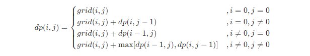

# 剑指 Offer 47. 礼物的最大价值

## 题目

&emsp;在一个 m*n 的棋盘的每一格都放有一个礼物，每个礼物都有一定的价值（价值大于 0）。你可以从棋盘的左上角开始拿格子里的礼物，并每次向右或者向下移动一格、直到到达棋盘的右下角。给定一个棋盘及其上面的礼物的价值，请计算你最多能拿到多少价值的礼物？


## 思路

* 状态定义：设动态规划矩阵dp,dp(i,j)代表从棋盘的左上角开始，到达单元格(i,j)时能拿到礼物的最大累计价值。
* 转移方程：
  * 当i = 0且j = 0时，为起始元素
  * 当i = 0且j != 0时，矩阵的第一行元素，只可以从左边到达
  * 当i != 0且j = 0时，矩阵的第一列元素，只可以从上边到达
  * 当i != 0且j != 0时，可以从左边或者上边到达

  


## 代码
```java
class Solution {
    public int maxValue(int[][] grid) {
        int m = grid.length,n = grid[0].length;// 取出矩阵的行数或者列数

        for(int i = 0; i < m; i++)
        {
            for(int j = 0; j < n; j++)
            {
                if(i == 0 && j == 0) continue;
                if(i == 0) grid[i][j] = grid[i][j] + grid[i][j - 1];// 从左边到达
                else if(j == 0) 
                {
                    grid[i][j] = grid[i][j] + grid[i - 1][j];
                }
                else{
                    grid[i][j] += Math.max(grid[i][j - 1],grid[i - 1][j]);
                }
            }
        }
        return grid[m - 1][n - 1];
    }
}
```


