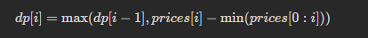

# 剑指 Offer 63. 股票的最大利润

## 题目
假设把某股票的价格按照时间先后顺序存储在数组中，请问买卖该股票一次可能获得的最大利润是多少？

## 思路

* dp[i]代表以prices[i]为结尾的子数组最大利润
* 状态转移方程：前i日最大利润 = max(前(i - 1)日最大利润，第i日价格 - 前i日最低价格)

  


## 代码

```java
class Solution {
    public int maxProfit(int[] prices) {
        int cost = Integer.MAX_VALUE,profit = 0;

        for(int price:prices){
            cost = Math.min(cost,price);// 找出历史最低价格
            profit = Math.max(profit,price - cost);// 更新最大利润
        }
        return profit;
    }
}

```
