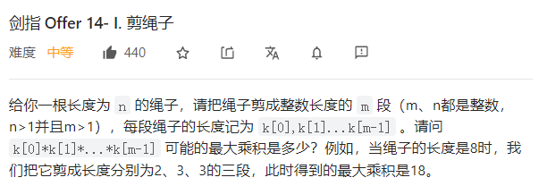

# 动态规划与贪婪算法

&emsp;动态规划的应用场景一般是：一个大问题可以被分解成小问题，分解之后每一个小问题也存在最优解。如果把小问题的最优解组合起来就可以得到整个问题的最优解。

&emsp;问题：如何把长度为N的绳子剪成若干段，使得各段的长度的乘积最大。这个问题的目标就是求出剪出的各段绳子长度的乘积最大值，也就是求一个问题的最优解，那么我们可以应用动态规划解决这个问题。


&emsp;**整体问题的最优解是依赖各个子问题的最优解**，这是动态规划的一大特点。**同时，大问题可以分解成若干个小问题，这些小问题之间还有相互重叠的子问题，公共子问题**。

&emsp;为了避免重复求解子问题，我们可以采用从下往上的顺序先计算小问题的最优解并存储下来，在以此为基础求解大问题的最优解。

# 面试题14-剪绳子

  

* 确定dp数组以及下标的含义：dp[i]表示将长度为i的绳子剪成至少两段绳子之后，这些绳子长度的最大乘积。

* 确定状态转移方程
  对长度为i的绳子剪出的第一段绳子长度是J，则：
  * 将i剪成j和i- j长度的绳子并且 i - j不再继续剪，此时的乘积是j x (i - j)
  * 将i剪成j和i - j的长度的绳子，并且i - j继续剪成多段长度的绳子，此时的乘积是j x dp[i - j]
  * 因此当J固定时，有dp[i] = max(j x (i - j),j x dp[i - j]),由于j的取值范围是1~i,那么就需要遍历所有的J得到dp[i]
* 初始化状态:dp[2] = 1,长度为2的绳子只能被剪成两段


```cpp
class Solution {
public:
    int cuttingRope(int n) {
      // 定义dp数组
      vector<int> dp(n + 1);
      // dp 数组初始化
      dp[2] = 1;
      for(int i = 3; i <= n; i++)
      {
          // 外层循环遍历所有的dp[i]
          for(int j = 1; j < i; j++)
          {
              dp[i] = max(dp[i],max((i - j) * j,dp[i - j] * j));// 状态转移方程
          }
      }
      return dp[n];
    }
};

```