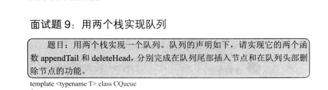

# 剑指offer笔记-栈和队列

## 一、栈和队列概述

&emsp;栈的特点就是后进先出，也就是后面压入栈中的元素会被第一个弹出。通常需要O(n)的时间才可以找到栈中最大或者最小元素。队列的特点是先进先出，第一个进入队列的元素将会第一个出来。

## 二、面试题：用两个栈实现队列

  


思路：先将所有的元素写入栈中，appendTail传入的数据全部压入栈中，另一个栈当作输出栈，用于出队操作。每次deleteHead时，若输出栈为空，将输入栈的全部数据依次弹出并压入输出栈，这样输出栈从栈顶往栈底的顺序就是队列从队首往队尾的顺序。

```java
class CQueue {

    private Stack<Integer> stack1;
    private Stack<Integer> stack2;

    public CQueue() {
        stack1 = new Stack<>();
        stack2 = new Stack<>();
    }
    
    public void appendTail(int value) {
        stack1.push(value);
    }
    
    public int deleteHead() {
        if(!stack2.isEmpty())
        {
            // 栈2 不为空  那么将栈2中的顶部元素pop
            return stack2.pop();
        }
        else
        {
            // 栈2 为空  那么将栈1中的全部元素全部push进栈1
            while(!stack1.isEmpty())
            {
                stack2.push(stack1.pop());
            }
            
            // 栈1 的元素 全部进入栈2 那么首先判断 栈2是不是空 如果为空  说明栈1没有元素 返回-1  不为空 立刻弹出栈顶元素
            if(stack2.isEmpty())
            {
                return -1;// 为空 说明 队列为空
            }
            else
            {
                return stack2.pop();// 队列不为空 直接pop
            }
        }
    }
}

/**
 * Your CQueue object will be instantiated and called as such:
 * CQueue obj = new CQueue();
 * obj.appendTail(value);
 * int param_2 = obj.deleteHead();
 */

```


