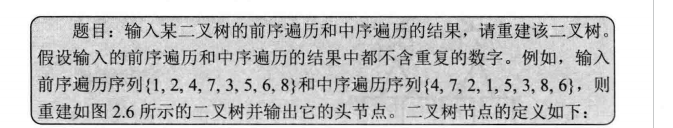
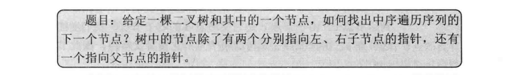

# 剑指offer-树学习笔记

## 一、二叉树概述

&emsp;二叉树是树的一种特殊数据结构，在二叉树中每一个节点最多能有两个子节点。在二叉树中最重要的操作莫过于遍历，即按照某一顺序访问树中的所有节点。通常有如下遍历方式：

* 前序遍历：先访问根节点，在访问左子节点，最后访问右子节点。
* 中序遍历：先访问左子节点，在访问根节点，最后访问右子节点
* 后序遍历：先访问左子节点，在访问右子节点，最后访问根节点。
* 宽度优先遍历：先访问树的第一层节点，再访问树的第二层节点...一直访问到最下面一层节点。在同一层节点中，以从左到右的顺序依次进行访问。


## 二、面试题七、重建二叉树

  


思路：只要我们在中序遍历中定位到根节点，那我们就可以直到左子树和右子树中节点的数目，那么我们也就知道左子树和右子树的遍历结果。然后就可以递归构造左子树和右子树。

&emsp;在中序遍历对根节点进行定位时，一种简单的方法是直接扫描中序遍历的结果找到根节点，但是时间复杂度高，我们采用哈希表来快速定位根节点（空间换时间），对于哈希映射中每一个键值对，键表示一个元素，值表示其在中序遍历中的出现位置。

```cpp
/**
 * Definition for a binary tree node.
 * struct TreeNode {
 *     int val;
 *     TreeNode *left;
 *     TreeNode *right;
 *     TreeNode(int x) : val(x), left(NULL), right(NULL) {}
 * };
 */
class Solution {
private:
    unordered_map<int,int> index;// 建立哈希表快速定位中序遍历根节点
public:
    TreeNode* myBuildTree(const vector<int>& preorder,const vector<int>& inorder,int preorder_left,int preorder_right,int inorder_left,int inorder_right)
    {   
        // 当左右边界相等 终止递归
        if(preorder_left > preorder_right)
        {
            return nullptr;// 递归出口
        }
        // 先序遍历第一个节点就是根节点
        int preorder_root = preorder_left;
        // 中序遍历定位根节点
        int inorder_root = index[preorder[preorder_root]];
        // 建立根节点
        TreeNode* root = new TreeNode(preorder[preorder_root]);
        // 获取左子树节点的数目
        int size_left_subtree = inorder_root - inorder_left;
        // 递归地构造左子树 并连接到根节点
        // 先序遍历中从左边界加一开始的size_left_subtree个元素就对应了中序遍历中从从左边界开始到根节点定位-1的元素
        root->left = myBuildTree(preorder,inorder,preorder_left + 1,preorder_left + size_left_subtree,inorder_left,inorder_root - 1);
        // 递归构造右子树
        root->right = myBuildTree(preorder,inorder,preorder_left + size_left_subtree + 1,preorder_right,inorder_root + 1,inorder_right);
        return root;
    }
    TreeNode* buildTree(vector<int>& preorder, vector<int>& inorder) {
       int n = preorder.size();
       // 构造哈希映射，帮助快速定位根节点
       for(int i = 0; i < n; i++)
       {
           index[inorder[i]] = i;// 键值一一对应
       }
       return myBuildTree(preorder,inorder,0,n - 1,0,n - 1);
    }
};


```

## 三、面试题八：二叉树的下一个节点

  


思路：

* 如果当前节点的右孩子节点不为空，那么找到当前节点的右孩子的最后一个不为空的左孩子节点，最后一个不为空的左孩子节点即为中序遍历序列的下一个节点
* 如果当前节点的右孩子节点为空，那么，从父节点一直想上找，判断当前的父节点是不是其父节点的左孩子节点，如果是的话该节点的父节点就是中序遍历的下一个节点

```cpp
/**
 * Definition for a binary tree node.
 * struct TreeNode {
 *     int val;
 *     TreeNode *left;
 *     TreeNode *right;
 *     TreeNode *father;
 *     TreeNode(int x) : val(x), left(NULL), right(NULL), father(NULL) {}
 * };
 */
class Solution {
public:
    TreeNode* inorderSuccessor(TreeNode* p) {
        
        // 如果当前节点有右孩子，那么右子树的最左侧节点就是当前节点的后继节点
        // 如果当前节点没有右孩子节点，那么就需要沿着父节点向上寻找，找到第一个是其父节点左孩子节点的节点
        // 那么该节点的父节点就是当前节点的后继节点。
        
        if(p->right != nullptr)
        {
            p = p->right;
            // 找到最左子节点
            while(p->left != nullptr)
            {
                 p = p->left;
            }
            return p;
        }
        
        // 如果节点的右孩子不存在 那么如果该节点是其父节点的左孩子，则返回父节点
        // 那如果该节点并不是父节点的左孩子节点，那么就继续向上遍历，查找父节点的父节点 判断条件同上。
        while(p->father != nullptr && p == p->father->right)
        {
            p = p->father;// 向上寻找父节点
            
            // p = p->father->left 停止
        }
        return p->father;// 父节点就是下一个节点
    }
};

```
