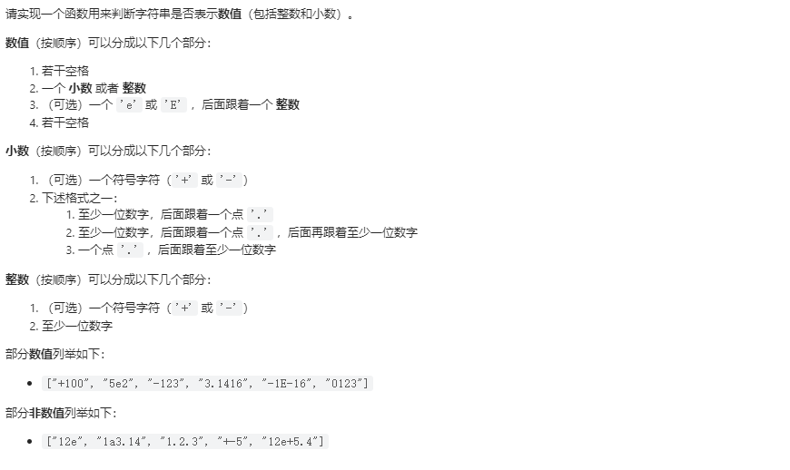

# 剑指Offer20-表示数值的字符串

## 题目
  


## 思路
&emsp; 参考剑指Offer


## 代码

```cpp
class Solution {
private:
    // 扫描符号位
    bool scanInteger(const string s,int& index)
    {
        if(s[index] == '+' || s[index] == '-')
        {
            ++index;// 扫描符号位
        }
        return scanUnsignedInteger(s,index); // 扫描数值位
    }

    // 扫描数值位
    bool scanUnsignedInteger(const string s,int& index)
    {
        int before = index;
        while(index != s.size() && s[index] >= '0' && s[index] <= '9')
        {
            index++;
        }
        // 扫描符号位之后的数值位 比如+123.123 那么扫描到 小数点这个位置之后就会停止 返回true
        return index > before;
    }

public:
    // 数字的格式可以用A[.[B]] [e|EC] 或者.B[e|EC]表示
    bool isNumber(string s) {
        if(s.size() == 0)
        {
            return false;
        }
        int index = 0;

        while(s[index] == ' ')
        {
            index++;//去除字符串中的空格
        }

        // 扫描符号位
        bool numeric = scanInteger(s,index);// 返回true

        if(s[index] == '.')
        {
            // 如果出现小数点
            ++index;
            // 小数可以没有整数部分，例如.123 等于0.123
            // 小数点后面可以

            // 继续扫描小数点之后的部分
            // 但是小数点后面可以没有数字 所以调用scanUnsignedInteger返回false,所以和numeric去或操作
            numeric = scanUnsignedInteger(s,index) || numeric;
        }
        // 如果出现'e' 或者 'E' 
        if(s[index] == 'e' || s[index] == 'E')
        {
            ++index;
            // 当e或者E前面没有数字的时候，整个字符串不可以表示数字，例如.e1 e1
            // 当e或者E后面没有整数的时候，整个字符串不能表示数字 例如12e    12e+5.4
            numeric = numeric && scanInteger(s,index);

        }

        // 字符串结尾有空格  可以返回true
        while(s[index] == ' ')
        {
            ++index;
        }

        return numeric && index == s.size();

    }
};

```


