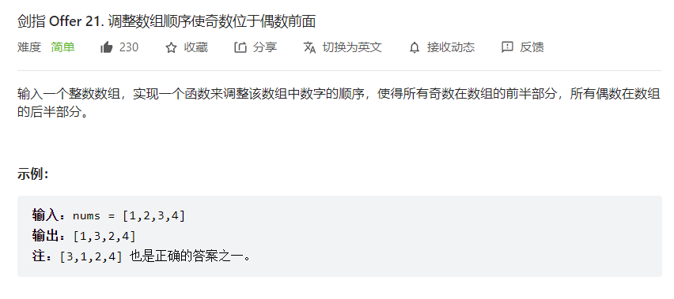

# 面试题21-调整数组顺序使奇数位于偶数前面

## 一、题目

  

## 二、思路

* 初始化：I,J双指针，分别指向数组nums左右两端
* 循环交换：当i >= j 跳出循环
  * 指针i遇到奇数时则执行i = i + 1跳过，直到找到偶数
  * 指针J遇到偶数则执行j = j  - 1跳过，直到找到奇数
  * 交换Nums[i]和nums[j]值

* 返回值：返回已经修改的nums数组


## 三、代码

```cpp
class Solution {
public:
    vector<int> exchange(vector<int>& nums) {
        int i = 0,j = nums.size() - 1;
        while(i < j)
        {
            while(i < j && (nums[i] & 1) == 1) i++;// 说明遇到了奇数 直接++  与运算效率更高
            while(i < j && (nums[j] & 1) == 0) j--; // 说明遇到了偶数  直接--

            swap(nums[i],nums[j]);
        }

        return nums;
    }
};
```


