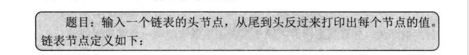

# 剑指offer-链表学习笔记

## 一、链表概述

&emsp;链表是一种动态的数据结构，在创建链表时，无需知道链表的长度，当插入一个节点时，我们只需要为新的节点分配内存，然后调整指针的指向来确保新节点被连接到链表中。内存分配不是在创建链表时一次性完成的，而是每添加一个节点分配一次内存。由于没有闲置的内存，链表的空间效率比数组高。链表节点定义如下：

```cpp
struct ListNode
{
    int m_nValue;
    ListNode* m_pNext;
};

```

向链表中插入一个节点：

```cpp
void AddToTail(ListNode** pHead,int value)
{
    ListNode* pNew = new ListNode();
    pNew->m_nValue = value;
    pNew->m_pNext = nullptr;

    if(*pHead == nullptr)
    {
        *pHead = pNew;// 空链表  头指针指向新的节点
    }
    else
    {
        ListNode* pNode = *pHead;

        // 找到尾节点
        while(pNode->m_pNext != nullptr)
        {
            pNode = pNode->m_pNext;
        }

        pNode->m_Next = pNew;// 连接新节点
    }
}

```

&emsp;当我们向一个空链表中插入一个节点时，新插入的节点就是链表的头指针。由于此时会改动头指针，那么必须把pHead参数设置成指向指针的指针，否则出了这个函数pHead仍然是一个空指针。

由于链表的内存不是一次性分配的，因此它的内存并不是连续的，找到链表中第i个节点时间复杂度是O(n)。

链表删除一个节点的代码：

```cpp
void RemoveNode(ListNode** pHead,int value)
{
    if(pHead == nullptr || *pHead == nullptr)
    {
        return;
    }

    ListNode* pToBeDeleted = nullptr;

    // 如果要删除的节点是头节点
    if((*pHead)->m_nValue == value)
    {
        pToBeDeleted = *pHead;
        *pHead = (*pHead)->m_pNext;
    }
    else
    {
        ListNode* pNode = *pHead;

        // 删除一个节点 就需要找到他的前驱节点
        while(pNode->m_pNext != nullptr && pNode->m_pNext->m_nValue != value)
        {
            pNode = pNode->m_pNext;
        }

        // 删除节点
        if(pNode->m_pNext != nullptr && pNode->m_pNext->m_nValue == value)
        {
            pToBeDeleted = pNode->m_pNext;
            pNode->m_pNext = pNode->m_Next->m_Next;
        }

    }

    if(pToBeDeleted != nullptr)
    {
        delete pToBeDeleted;
        pToBeDeleted = nullptr;
    }
}

```


## 二、面试题6：从头到尾打印链表

  

&emsp;输出的顺序是从后往前，那么可以使用栈这种数据结构，每次经过一个节点，就将该节点放入栈中。当遍历完整个链表之后，在从栈顶开始依次输出各个节点的值。

```cpp
/**
 * Definition for singly-linked list.
 * struct ListNode {
 *     int val;
 *     ListNode *next;
 *     ListNode(int x) : val(x), next(NULL) {}
 * };
 */
class Solution {
public:
    vector<int> reversePrint(ListNode* head) {
        stack<int> st;// 定义一个栈
        ListNode* cur = head;
        vector<int> result;// 存储结果的数组  返回result

        // 将数据压入栈中
        while(cur != NULL)
        {
            st.push(cur->val);// 将值压入栈中即可
            cur = cur->next;// 带头结点的链表
        }

        // 出栈 打印数值
        while(!st.empty())
        {
            result.push_back(st.top());// 将栈顶元素放入result数组
            st.pop();// 出栈
        }
        return result;
    }
};

```

