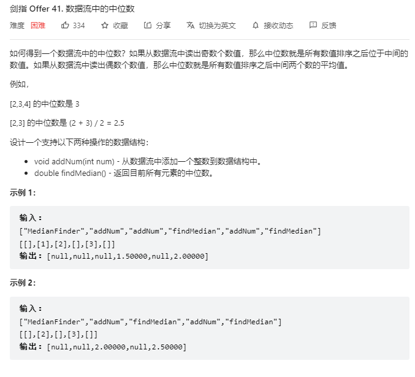

# 面试题41.数据流中的中位数

## 题目
  

## 思路

看看K神的题解：```https://leetcode.cn/problems/shu-ju-liu-zhong-de-zhong-wei-shu-lcof/solution/mian-shi-ti-41-shu-ju-liu-zhong-de-zhong-wei-shu-y/```


## 代码

```python
class MedianFinder(object):

    def __init__(self):
        """
        initialize your data structure here.
        """
        self.A = []  # 小根堆 堆顶元素是最大值
        self.B = []  # 大根堆 堆顶元素是最小值

    def addNum(self, num):
        """
        :type num: int
        :rtype: None
        """
        if len(self.A) != len(self.B):
            heappush(self.B,-heappushpop(self.A,num))

        else:
            heappush(self.A,-heappushpop(self.B,-num))

    def findMedian(self):
        """
        :rtype: float
        """
        return self.A[0] if len(self.A) != len(self.B) else (self.A[0] - self.B[0]) / 2.0

# Your MedianFinder object will be instantiated and called as such:
# obj = MedianFinder()
# obj.addNum(num)
# param_2 = obj.findMedian()

```

