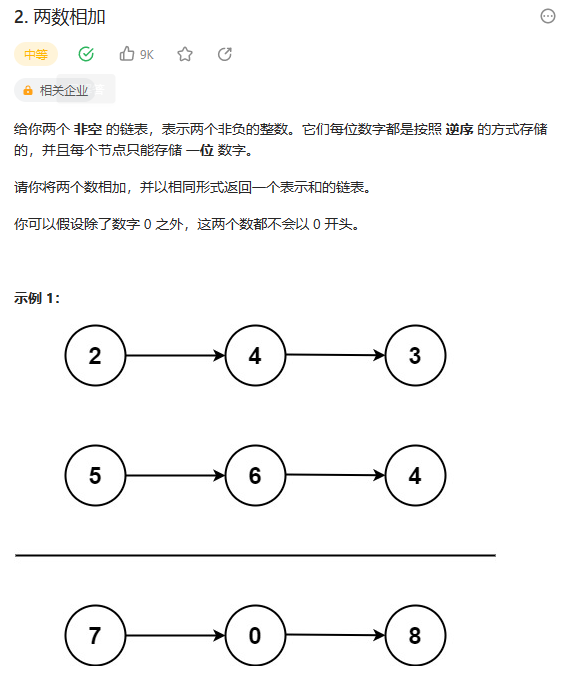

# 2. 两数相加

## 题目

  


## 思路

* 链表从头开始存放数据的个位十位 百位
* 新建一个链表C，将链表A和B每一个相加的结果存放在C中，注意加法的进位

## 代码

```java
/**
 * Definition for singly-linked list.
 * public class ListNode {
 *     int val;
 *     ListNode next;
 *     ListNode() {}
 *     ListNode(int val) { this.val = val; }
 *     ListNode(int val, ListNode next) { this.val = val; this.next = next; }
 * }
 */
class Solution {
    public ListNode addTwoNumbers(ListNode l1, ListNode l2) {
        // 使用高精度加法模板
        ListNode l3 = new ListNode(-1) ;
        ListNode node = l3;// 保存头节点 用于结果返回

        ListNode p = l1;
        ListNode q = l2;
        int t = 0;// 进位

        while(p != null || q != null)
        {
            if(p != null)
            {
                t+=p.val;
                p = p.next;
            }

            if(q != null)
            {
                t+= q.val;
                q = q.next;
            }

            // 将结果封装成节点 插入
            ListNode tmp = new ListNode(t % 10);
            l3.next = tmp;
            l3 = l3.next;
            t = t / 10;
        }

        if(t != 0)
        {
            l3.next = new ListNode(1);
        }

        return node.next;

    }
}

```
