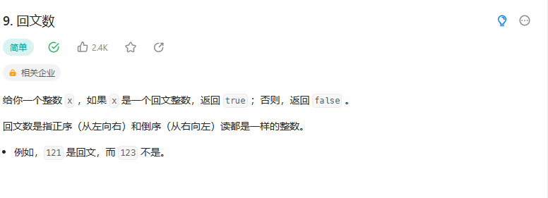

# 9. 回文数

## 题目
  


## 思路

* 设置双指针 一个指向开始 一个指向末尾
* 前后比较指针指向的数字


## 代码
```java
class Solution {
    public boolean isPalindrome(int x) {
        if(x < 0)
        {
            return false;
        }
        else if(x >= 0 && x <= 9)
        {
            return true;
        }


        String s = String.valueOf(x);// 转换成字符串

        // 使用双指针  前后指针

        int i = 0;
        int j = s.length() - 1;

        while(i < j)
        {
            
            char a = s.charAt(i);
            char b = s.charAt(j);
            if(a == b)
            {
                i++;
                j--;
                
            }
            else
            {
                return false;
            }

            if(i==j)
            {
                return true;
            }
        }

        return true;
    }
}

```
