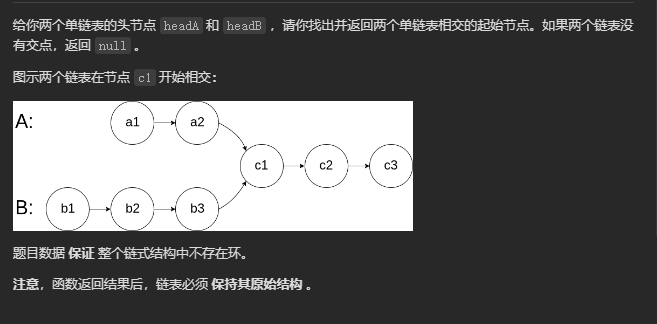

# 面试题 02.07. 链表相交

## 题目
  


## 思路

* 设headA长度是a,headB长度是b,两个链表的公共部分长度是c
* 构建两个指针，A，B，分别指向两个链表头节点headA,headB
* 先让指针A遍历完链表headA,然后在开始遍历链表headB,如果两个链表存在公共节点node,那么指针A走的长度就是a + (b - c)

* 指针B先遍历完headB,在开始遍历链表headA,当走到node时，走过的长度就是b + (a - c)
* 此时两个指针相遇，如果不相遇，说明c = 0,那么此时A,B指针都走到链表末尾 全部指向NULL

## 代码

```cpp
/**
 * Definition for singly-linked list.
 * struct ListNode {
 *     int val;
 *     ListNode *next;
 *     ListNode(int x) : val(x), next(NULL) {}
 * };
 */
class Solution {
public:
    ListNode *getIntersectionNode(ListNode *headA, ListNode *headB) {
        // 双指针 
        ListNode *A = headA;
        ListNode *B = headB;

        while( A != B)
        {
            if(A == NULL)
            {
                // 如果A指针走到了末尾
                A = headB;// 令A指针走B链表
            }
            else
            {
                A = A->next;
            }

            if(B == NULL)
            {
                B = headA;
            }
            else
            {
                B = B->next;
            }

        }

        return B;

    }
};

```
