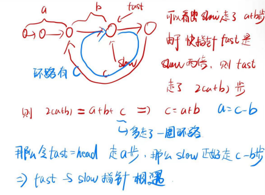

# 面试题 02.08. 环路检测

## 题目

给定一个链表，如果它是有环链表，实现一个算法返回环路的开头节点。若环不存在，请返回 null。

如果链表中有某个节点，可以通过连续跟踪 next 指针再次到达，则链表中存在环。 为了表示给定链表中的环，我们使用整数 pos 来表示链表尾连接到链表中的位置（索引从 0 开始）。 如果 pos 是 -1，则在该链表中没有环。注意：pos 不作为参数进行传递，仅仅是为了标识链表的实际情况。


## 思路

* 设置快慢指针，一开始fast和slow都指向head
* 快指针fast每次走两步，slow指针每次走一步
* 那么当快慢指针第一次相遇的时候，慢指针走了a + b步，快指针走了2(a + b)步，那么又因为快指针走的步数可以表示为a + b + c 多走一圈c,那么a +b+ c = 2(a + b) ,a = c - b,那么此时令fast = head,fast和slow指针都走，每次走一步，当fast走a步之后，slow与fast指针就会相遇

  


## 代码

```CPP
/**
 * Definition for singly-linked list.
 * struct ListNode {
 *     int val;
 *     ListNode *next;
 *     ListNode(int x) : val(x), next(NULL) {}
 * };
 */
class Solution {
public:
    ListNode *detectCycle(ListNode *head) {
        // 不可能存在环路的情况直接返回
        if(head == NULL || head->next == NULL)
        {
            return NULL;
        }

        // 定义快慢指针
        ListNode *fast = head;
        ListNode *slow = head;

        while(fast != NULL && fast->next != NULL)
        {
            // 快指针走的速度是慢指针的两倍
            fast = fast->next->next;
            slow = slow->next;

            // 快慢指针在环中相遇
            if(fast == slow)
            {
                // 当两个指针相遇的时候  快慢指针同步移动
                fast = head;// fast指针走a步 slow指针走 c - b步 a = c - b 两指针相遇
                while(fast != slow)
                {
                    fast = fast->next;
                    slow = slow->next;
                }

                return slow;

            }
        }

        return NULL;

    }
};
```
