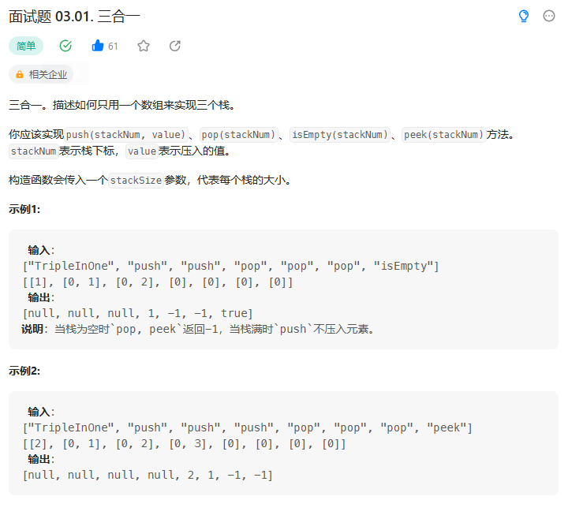
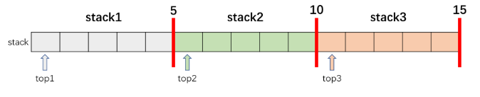

# 面试题 03.01. 三合一

## 题目
  


## 思路

* 将一个数组拆分成三个栈  也就是三段
* 每一段的开始位置作为栈顶起始位置
* 在入栈和出栈操作 都需要判断栈顶指针的位置
  
  


## 代码

```java
class TripleInOne {
private:
    vector<int> s;
    int stackSize;// 栈大小
    int spointer[3];// 维护每一个栈的栈顶指针的初始位置

public:
    TripleInOne(int stackSize) {
        s = vector<int>(stackSize * 3);// 三个栈在一个数组当中
        this->stackSize = stackSize;
        spointer[0] = 0;
        spointer[1] = stackSize;// 第二个栈的栈顶位置
        spointer[2] = stackSize * 2;// 第三个栈的栈顶位置
    }
    
    void push(int stackNum, int value) {
        // 将元素push进入指定的栈
        //看看栈元素是否溢出
        if(spointer[stackNum] < (stackNum + 1) * stackSize)
        {
            s[spointer[stackNum]] = value;
            spointer[stackNum]++;
        }
    }
    
    int pop(int stackNum) {

        int res = -1;
        if(spointer[stackNum] > stackNum * stackSize)
        {
            res = s[--spointer[stackNum]];
        }
        return res;
    }
    
    int peek(int stackNum) {
        int res = -1;
        if(spointer[stackNum] > stackNum* stackSize){
            res = s[spointer[stackNum] - 1];
        }

        return res;
    }
    
    bool isEmpty(int stackNum) {
        return spointer[stackNum] == stackNum * stackSize;// 指针在原处
    }
};

/**
 * Your TripleInOne object will be instantiated and called as such:
 * TripleInOne* obj = new TripleInOne(stackSize);
 * obj->push(stackNum,value);
 * int param_2 = obj->pop(stackNum);
 * int param_3 = obj->peek(stackNum);
 * bool param_4 = obj->isEmpty(stackNum);
 */

```
