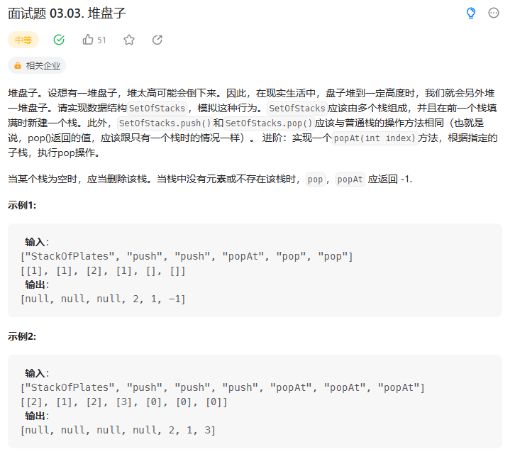

# 面试题 03.03. 堆盘子

## 题目
  

## 思路

* 新建 一个List 存放多个栈
* 每次push元素 检查一下 list有没有栈 或者 最后一个栈是不是还有空间
* 如果可以push 将元素push进入最后一个栈中
* 每次pop元素 将最后一个栈中的元素pop出去 如果最后一个栈空，直接移除该栈


## 代码

```java
class StackOfPlates {

    private List<Stack<Integer>> stackList;// 存放多个栈 栈的个数是动态变化的
    private int cap;//  栈的容量

    // push操作  直接插入最后一个栈中 或者  新建一个栈 然后插入其中

    public StackOfPlates(int cap) {
        stackList = new ArrayList<>();
        this.cap = cap;
    }
    
    public void push(int val) {
        if(cap <= 0){
            return ;
        }
        // 如果一个栈也不存在 或者  最后一个栈的容量已经满了
        if(stackList.isEmpty() || stackList.get(stackList.size() - 1).size() == cap){
            Stack<Integer> stack = new Stack<>();// 新建一个栈
            stack.push(val);
            stackList.add(stack);
            return;
        }
        // 不需要新建一个栈 直接存入最后一个栈
        stackList.get(stackList.size() - 1).push(val);
    }
    
    public int pop() {
        return popAt(stackList.size() - 1);// 直接弹出最后一个栈中的元素
    }
    
    public int popAt(int index) {
        // 根据指定子栈 执行pop操作
        if(index < 0 || index >= stackList.size()){
            return -1;
        }

        // 获取指定的子栈
        Stack<Integer> s = stackList.get(index);

        if(s.isEmpty())
        {
            return -1;// 栈是空的
        }

        int res = s.pop();// 直接弹出

        if(s.isEmpty()){
            stackList.remove(index);//如果弹出之后 该栈已经变为空 直接 移除该栈
        }

        return res;
    }
}

/**
 * Your StackOfPlates object will be instantiated and called as such:
 * StackOfPlates obj = new StackOfPlates(cap);
 * obj.push(val);
 * int param_2 = obj.pop();
 * int param_3 = obj.popAt(index);
 */

```

