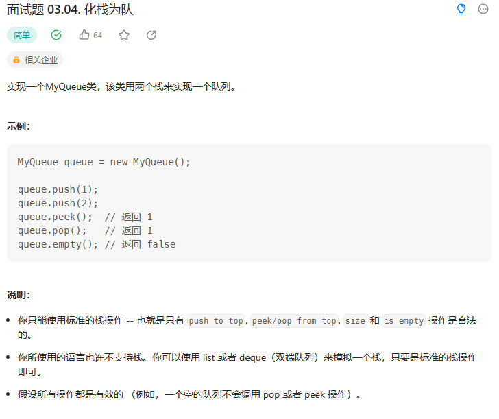

# 面试题 03.04. 化栈为队

## 题目
  


## 思路
* 创建两个栈 一个输入栈 一个输出栈  输入栈用于压入push进来的数据， 输出栈用于弹出数据
* 每次弹出数据的时候 如果输出栈是空的 将输入栈中的所有数据全部压入输出栈中 不可以是一部分 这样达到先进先出的目的


## 代码

```java
class MyQueue {

    // 创建两个栈 一个输入栈 一个输出栈  输入栈用于压入push进来的数据， 输出栈用于弹出数据
    // 每次弹出数据的时候 如果输出栈是空的 将输入栈中的所有数据全部压入输出栈中 不可以是一部分 这样达到先进先出的目的
    Deque<Integer> inStack;
    Deque<Integer> outStack;

    /** Initialize your data structure here. */
    public MyQueue() {
        inStack = new ArrayDeque<Integer>(); // 输入栈初始化
        outStack = new ArrayDeque<Integer>();// 输出栈初始化
    }
    
    /** Push element x to the back of queue. */
    public void push(int x) {
        // 将数据压入输入站中
        inStack.push(x);
    }
    
    /** Removes the element from in front of queue and returns that element. */
    public int pop() {
        // 判断输出栈是否为空
        if(outStack.isEmpty())
        {
            // 输入栈中的数据全部押入输出栈中
            while(!inStack.isEmpty())
            {
                outStack.push(inStack.pop());
            }
        }

        return outStack.pop();
    }
    
    /** Get the front element. */
    public int peek() {
        if(outStack.isEmpty()){
            while(!inStack.isEmpty())
            {
                outStack.push(inStack.pop());
            }
        }

        return outStack.peek();
    }
    
    /** Returns whether the queue is empty. */
    public boolean empty() {
        // 输入栈和输出栈都没有数据 判定为空
        return inStack.isEmpty() && outStack.isEmpty();
    }
}

/**
 * Your MyQueue object will be instantiated and called as such:
 * MyQueue obj = new MyQueue();
 * obj.push(x);
 * int param_2 = obj.pop();
 * int param_3 = obj.peek();
 * boolean param_4 = obj.empty();
 */

```

