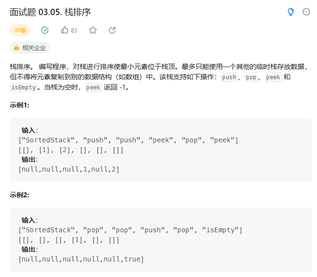
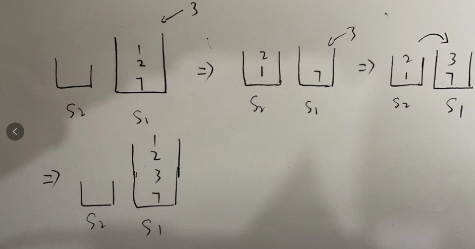

# 面试题 03.05. 栈排序

## 题目
  


## 思路

  


## 代码


```cpp
class SortedStack {
public:
    stack<int> s1,s2;
    SortedStack() {

    }
    
    void push(int val) {
        // 比较栈顶元素  和 当前要插入元素的大小
        // 如果栈顶元素 小于  当前要插入的元素
        // 栈顶元素 进入辅助栈 将当前要插入的元素送入栈中
        while(!s1.empty() && s1.top() < val)
        {
            s2.push(s1.top());
            s1.pop();
        }
        s1.push(val);
        // 将辅助栈中的元素送回去
        while(!s2.empty()){
            s1.push(s2.top());
            s2.pop();
        }
    }
    
    void pop() {
        if(!s1.empty()){
            s1.pop();
        }
    }
    
    int peek() {
        if(!s1.empty()){
            return s1.top();
        }

        return -1;
    }
    
    bool isEmpty() {
        return s1.empty();
    }
};

/**
 * Your SortedStack object will be instantiated and called as such:
 * SortedStack* obj = new SortedStack();
 * obj->push(val);
 * obj->pop();
 * int param_3 = obj->peek();
 * bool param_4 = obj->isEmpty();
 */

```
