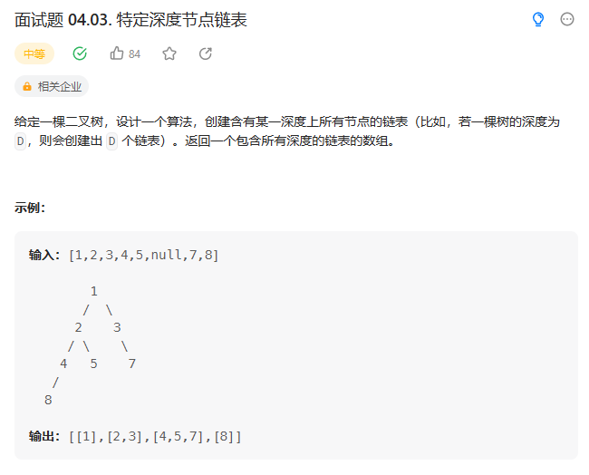
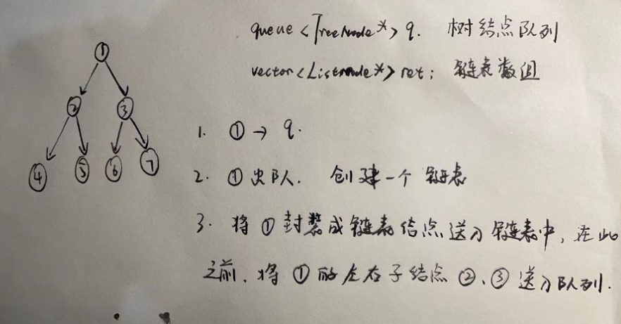

# 面试题 04.03. 特定深度节点链表

## 题目

  


## 思路

* 二叉树的层次遍历
* 创建一个二叉树的节点队列
* 将根节点入队
* 将根节点出队，将根节点的左右节点入队，同时将出队的节点送一个新建的链表中
* 再将该链表送入链表数组中

  


## 代码

```cpp
/**
 * Definition for a binary tree node.
 * struct TreeNode {
 *     int val;
 *     TreeNode *left;
 *     TreeNode *right;
 *     TreeNode(int x) : val(x), left(NULL), right(NULL) {}
 * };
 */
/**
 * Definition for singly-linked list.
 * struct ListNode {
 *     int val;
 *     ListNode *next;
 *     ListNode(int x) : val(x), next(NULL) {}
 * };
 */
class Solution {
public:
    vector<ListNode*> listOfDepth(TreeNode* tree) {
        // 二叉树的层次遍历
        // 创建节点队列

        queue<TreeNode*> q;
        // 将根节点入队
        q.push(tree);

        vector<ListNode*> ret;// 包含所有深度的链表的数组

        while(!q.empty())
        {
            // 取出队头的节点
            int sz = q.size();// 当前队列中的所有节点数
            ListNode* head = new ListNode(0);
            ListNode *p = head;// 创建头节点

            while(sz--)
            {
                // 取出队头节点 将被左右子树入队
                TreeNode *cur = q.front();
                // 队头节点出队
                q.pop();

                // 将左右孩子节点入队
                if(cur->left != NULL){
                    q.push(cur->left);
                }

                if(cur->right != NULL){
                    q.push(cur->right);
                }

                // 将P指针指向当前节点值
                p->next = new ListNode(cur->val);
                p = p->next;
            }

            // 将当前层的链表存入ret中
            ret.push_back(head->next);

            delete head;// 释放内存

        }

        return ret;
    }
};

```
