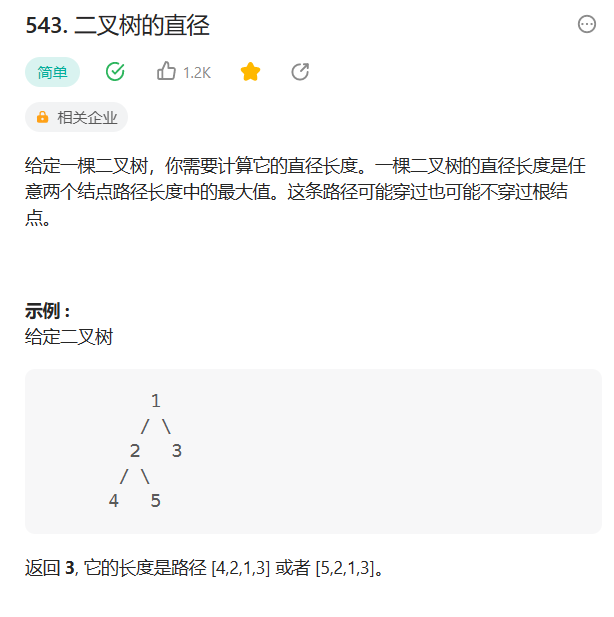

# 二叉树

## 543. 二叉树的直径

### 题目
  

### 思路

* 这道题本质是求解经过根节点的最长路径
* 计算根节点左侧最长路径Left 以及 右侧最长路径right
* 经过根节点就是left + right


* 算法流程
* 先判断当前节点是不是叶子节点
* 然后判断当前节点的左子树是不是null 不是的话 直接递归判断左子树 路径长度 + 1
* 右子树做法同
* 将left 和right相加 计算最大值

### 代码

```java
/**
 * Definition for a binary tree node.
 * public class TreeNode {
 *     int val;
 *     TreeNode left;
 *     TreeNode right;
 *     TreeNode() {}
 *     TreeNode(int val) { this.val = val; }
 *     TreeNode(int val, TreeNode left, TreeNode right) {
 *         this.val = val;
 *         this.left = left;
 *         this.right = right;
 *     }
 * }
 */
class Solution {
    int res = 0;
    public int diameterOfBinaryTree(TreeNode root) {
        // 这道题本质就是求解经过根节点的最长路径
        // 计算根节点的左侧最长路径left 以及 右侧最长路径right
        // 经过根节点的最长路径就是Left + right
        maxPath(root);
        return res; 
    }
    int maxPath(TreeNode root){
        // 遇到叶子节点  直接返回0
        if(root == null){
            return 0;
        }
        int left = 0;
        int right = 0;
        // 递归的结果是当前节点的左右子树较长的  左子树不为空 才递归左子树 右子树不为空 递归右子树
        if(root.left != null){
            left = maxPath(root.left) + 1;// 递归左子树    
        }else{
            left = 0;
        }

        if(root.right != null){
        right =  maxPath(root.right) + 1;// 递归右子树

        }else{
            right = 0;
        }
       
        
        res = res > (left + right)? res:(left + right);
        return left > right ? left:right;// 返回左右路径较长者
    }
}

```


