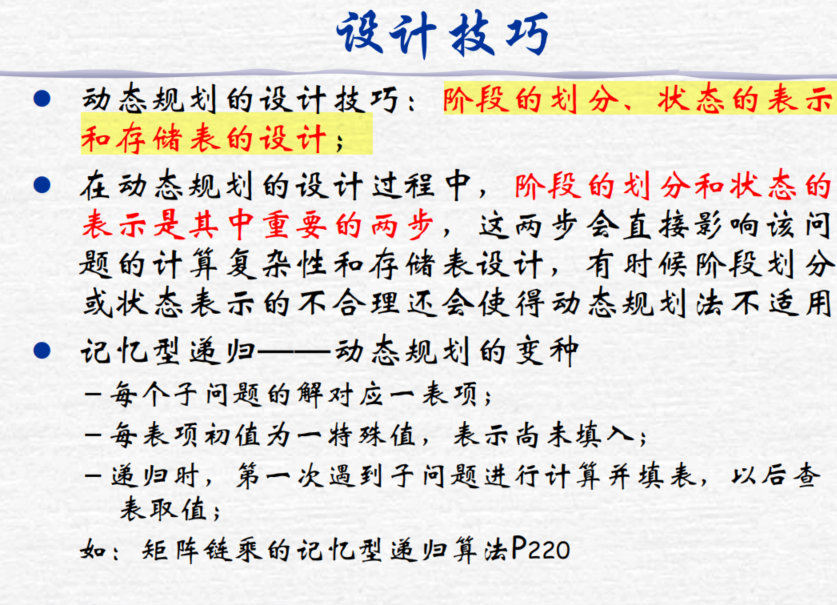
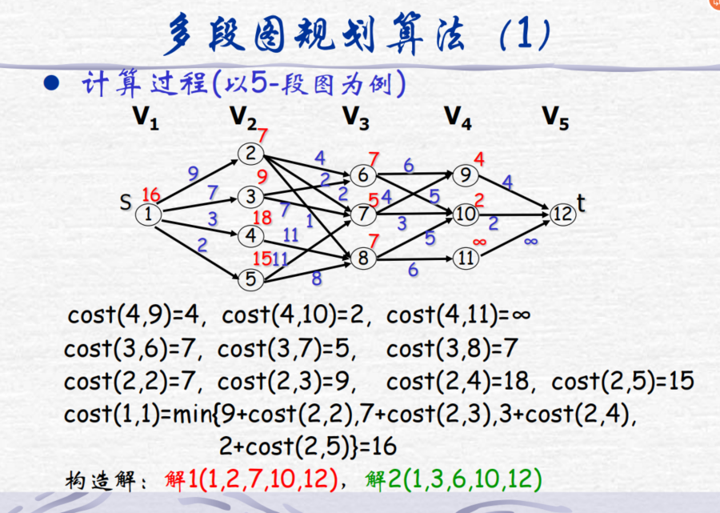
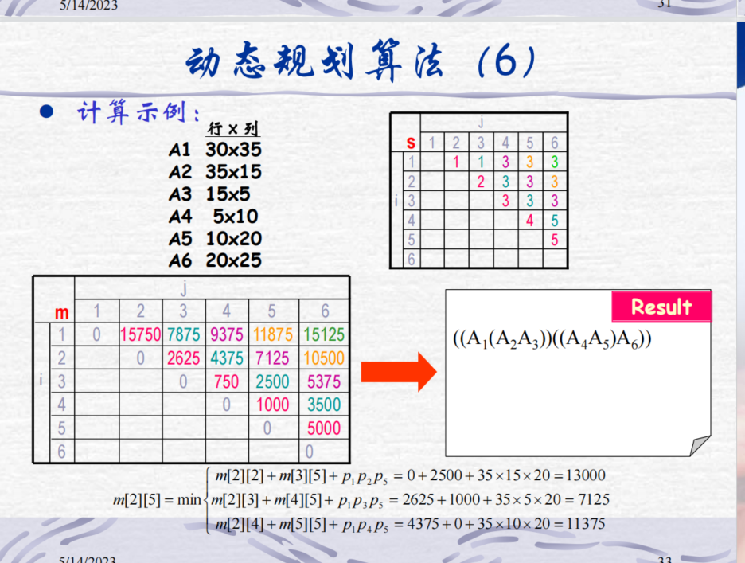
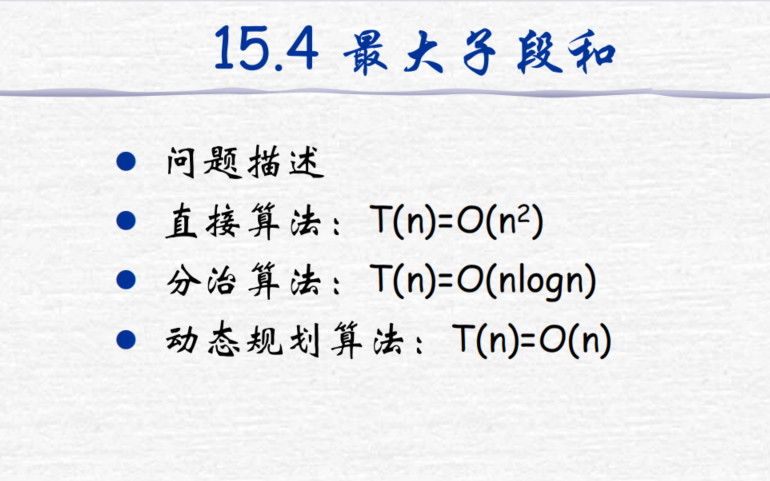
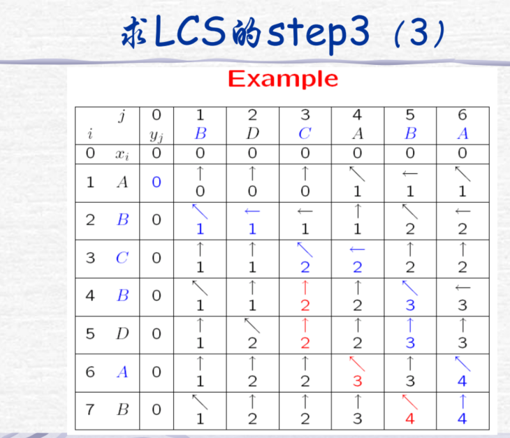
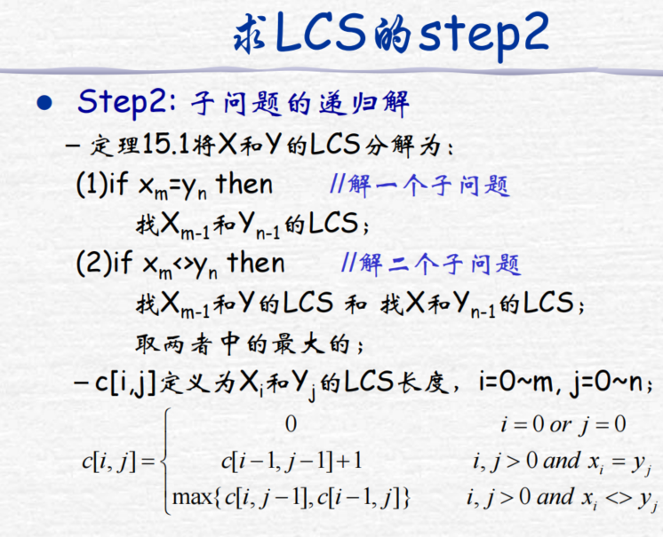

## 引言(ch1)
1. **什么是算法及其特征**
  算法是通过一个有限的指令序集合对特定问题进行求解的一种计算执行描述
  特性：输入、输出、确定性、有限性、正确性、通用性
2. **问题实例和问题规模**
  问题规模即输出实例的大小
## 算法初步(ch2)
1. 插入排序算法及其时间复杂度
```c++
//A为输入
InsertSort(A){
    for i = 2 to lenght(A) do
        key = A[i];
        j = i - 1;
        while(j > 0 and A[j] > key) do
            A[j + 1] = A[j];
            j--;
        A[j + 1] = key;
}
```
时间复杂度为：最好O(n)；最坏O(n^2)；平均O(n^2)
2. 算法复杂性及其度量
  (1)时间复杂性和空间复杂性；
  (2)最坏、最好和平均情形复杂性；
3. 归并排序算法及其时间复杂性 
```c++
//A为输入
MergeSort(A,p,q,r){
    n1 = q - p + 1; //左侧元素个数
    n2 = r + q;     //右侧元素个数
    B = A[p,q];
    C = A[q + 1,r];
    B[n1 + 1] = INF;  //哨兵
    C[n2 + 1] = INF; 
}
```
时间复杂度为O(nlogn)
## 函数增长率(ch3)
1. 渐近记号O、Ω、θ的定义及其使用
  - O渐进上界
  eg：证明f(n) = O(g(n)) -> 存在C，n0，使得当n>=n0时，0 <= f(n) <= Cg(n)
  - Ω渐进下界
  eg：证明f(n) = Ω(g(n)) -> 存在C，n0，使得当n>=n0时，0 <= Cg(n) <= f(n)
  - θ渐进界
  eg：证明f(n) = θ(g(n)) -> 存在C1，C2，n0使得当n>=n0时，C1g(n) <= f(n) <= C2g(n)
2. 标准复杂性函数及其大小关系
TODO：拿题练练手
3. 和式界的证明方法
TODO：拿题练练手
## 递归关系式(ch4，Sch1)
1. 替换法
(1)猜测解，数学归纳法证明；
(2)变量变换法；
2. 迭代法
(1)展开法；
(2)递归树法；
3. 主定理
- case1：若对某个常数ε>0有
$$f(n) = O(n^{\log_{b}a - ε})$$
则有
$$T(n) = θ(n^{\log_{b}a})$$
- case2：若
$$f(n) = θ(n^{\log_{b}a})$$
则有
$$T(n) = θ(n^{\log_{b}a}\lg(n))$$
- case3：若对某个常数ε>0有
$$f(n) = Ω(n^{\log_{b}a + ε})$$
且对某个常数c<1和所有足够大的n有
$$af(n/b) \leq cf(n)$$
则有
$$T(n) = θ(f(n))$$

4. 补充1：递归与分治法(sch1)
   - 递归设计技术
   - 递归程序的非递归化
   - 算法设计
(1)Fibonacci数；                   (2)生成全排列；
(3)二分查找；                     (4)大整数乘法；
(5)Stranssen矩阵乘法；             
## 堆排序(ch6)
1. 堆的概念和存储结构
2. 堆的性质和种类
3. 堆的操作及其操作时间：建堆；整堆；
4. 堆排序算法和时间复杂性
O(nlogn)
5. 优先队列及其维护操作
## 快速排序(ch7)
1. 快速排序算法及其最好、最坏时间和平均时间
O(nlogn) O(n^2) O(nlogn)
2. 随机快速排序算法及其期望时间
```c++
QuickSort(A, low, high){
    if low > high  then return;
    pivot = Partition(A, low, high);
    QuickSort(A, low, pivot-1);
    QuickSort(A, pivot+1, high);
}
```
时间复杂度为O(nlogn)
3. Partition算法
```c++
Partition(A, low, high){
    pivot = A[low]; //优化可以随机基准和三数取中基准
    while low < high then
        while A[high] >= pivot then high--;
        swap(A[high], A[high]);
        while A[low] <= pivot then low++;
        swap(A[high], A[high]);
    return low
}
```
## 线性时间排序(ch8)
1. 基于比较的排序算法下界：Ω(nlogn)
2. **计数排序适应的排序对象、算法和时间**
```C++
//A为输入，B为输出，k为Ai的取值范围
CountingSort(A,B,k){
    for i = 1 to k do C[i] = 0;
    //C中存放各元素数量
    for j = 1 to length(A) do
        C[A[j]]++;
    //C中存放比i小的元素数量
    for i = 2 to k do
        C[i] = C[i-1]+C[i];
    //在合适的位置放入，downto是为了确保稳定性
    for j = length(A) downto 1 do
        B[C[A[j]]] = A[j];
        C[A[j]]--;
}
```
时间复杂度为θ(n+k) = θ(n)，如果k=θ(n)
3. **基数排序适应的排序对象、算法和时间**
```c++
//A为输入，d为用k进制表示的最大位数
RadixSort(A,d){
    for i = 1 to d do
      //使用稳定算法对A的第i位排序(例如技术算法)  
}
```
时间复杂度为θ(d(n+k)) = θ(n)，如果k=θ(n)且d为常数
4. **桶排序适应的排序对象、算法和时间**
```c++
//A为输入，0 <= A[1..n] < 1
BucketSort(A){
    n = length(A)
    for i = 1 to n do
        //将A[i]插入到链表B[⌊nA[i]⌋]中
    for i = 0 to n-1 do
        //用插入排序将B[i]排序
    //将B[0]...B[n-1]连接起来
}
```
时间复杂度为θ(n)，当元素均匀分布，即每个桶内大约只有一个元素时
## 中位数和顺序统计(ch9)
1. 最大和最小值的求解方法
每次输入两个值x和y，让max(x,y)与curmax比较，让min(x,y)与curmin比价
2. 期望时间为线性的选择算法
```c++
//A为输入，pr为上下界，i为寻找第i元最小值
RandomizedSelect(A,p,r,i){
    if p = r then return; //临界处理
    q = RandomizedPartion(A,p,r); //进行划分，并返回划分元的下标
    k = q - p + 1;  //A[q]是第k个最小元
    if k = i then
        return A[q]
    else if k < i then
        RandomizedSelect(A, p, q-1, i);
    else k > i then
        RandomizedSelect(A, q+1, r, i);
}
```
时间复杂度为：最好情况下θ(n)；最坏情况下θ(n^2)；平均θ(n)
3. 最坏时间为线性的选择算法及其时间分析
```c++
when n > 1 do
    //5个一组，划分n个元素
    //组内插入排序，取中值
    //递归的使用算法求⌈n/5⌉个中值的中值x
    //用x作为划分元对A数组进行划分，设x为第k个最小元
    //if k = i then 寻找左区间的第k个最小元
    //else 寻找右区间的第i-k个最小元
```
时间复杂度为：最坏情况下O(n)
## 红黑树(ch13)
1. 红黑树的定义和节点结构
   根叶黑，不红红，黑高同 
2. 黑高概念
   bh(x) = x节点到它任意后代叶子节点路径上的黑节点数(不包括x本身) 
3. 一棵n个内点的红黑树的高度至多是2log(n+1)
   - 假设对任何以x为根的子树，其内节点数>=2^bh(x) - 1 
   - 当bh(x) = 0时，即x为nil[T]，内节点数为0 >= 0，命题正确
   - 假设对x左右孩子命题正确，x左右孩子的黑高为bh(x) 或 bh(x)-1，所以x的内点数 = 左孩子内点数 + 右孩子内点数 + 1 >= 2^bh(x) - 1
   - 因为红节点的孩子必为黑，所以红节点的层数 < h/2，所以bh(root[T]) >= h/2
   - 内节点数为n，n >= 2^bh(x) - 1 >= 2^(h/2) - 1
   - 得证 h <= 2log(n+1)
4. 左旋算法
```c++
LeftRotate(T,x){
//假定right[x] != nil[T]
    y = right[x];
    right[x] = left[y]
    p[y] = p[x]
    if p[x] = nil[T] then
        root[T] = y
    else 
        if x = left[p[x]] then //如果x是左孩子
            left[p[x]] = y;
        else 
            right[p[x]] = y;   //如果是右孩子
    left[y] = x;
    p[x] = y;
}
```
5. 插入算法的时间、至多使用2次旋转
时间复杂度O(logn)
- 插入节点的父节点为黑 -> 无须变动
- 插入节点的父节点为红
  - 叔节点为红 -> 父节点和叔节点变黑，祖父节点变红，将祖父节点视作新插入节点
  - 叔节点不存在or叔节点为黑
    - LL -> 右旋，父节点变黑，祖父节点变红
    - RR -> 左旋，父节点变黑，祖父节点变红
    - LR -> 左旋+右旋，新节点变黑，祖父节点变红
    - RL -> 右旋+左旋，新节点变黑，祖父节点变红
每次插入后将祖父节点变黑(防止第二种情况将根节点变红)


1. 删除算法的时间、至多使用3次旋转
时间复杂度O(logn)
## 数据结构的扩张(ch14)
1. 动态顺序统计：
(1)节点结构的扩展；
添加了成员变量size, 表示以该节点为根的子树中的内部节点数(包括该节点)

(2)选择问题的算法；
```c++
OSSelect(x,i){
    r = size[left[x]] + 1;
    if r = i then return x
    if i < r
        OSSelect(left[x], i);   //左子树中寻找第i小的元素
    else
        OSSelect(right[x], i-r);//右子树中寻找第i-r小的元素
}
```
时间复杂度O(logn)
(3)Rank问题的算法；
```c++
OSRank(x){
    r = size[left[x]] + 1;
    while x!= root do
        if x = left[p[x]] then
        if x = right[p[x]] then
            r = r + size[left[p[x]]] + 1;
        x = p[x];
    return r;
}
```
时间复杂度O(logn)
(4)维护树的成本分析；
O(logn)
1. **区间树的扩张和查找算法**
节点保存区间int = {low,high}，key = low
添加成员变量max，max = max(high, max[left[x]], max[right[x]])
维护max有效性
添加查找重叠区间的操作
```c++
IntervalSearch(T, i){
    x = root[T];
    while x != nil[T] and !isOverlap(int[x], i) do //若x不为空且不与i重叠
        if left[x] and max[left] > low[i] then   //左侧有重叠
            x = left[x];
        else
            x = right[x];
    return x;   //x = nil or x与i重叠
}
```
## 动态规划(ch15)
1. **方法的基本思想和基本步骤**
   基本思想：分治思想和解决冗余


    动态规划的步骤：
   - 找出最优解的性质，并刻画其最优子结构特征
   - 递归地定义最优值(写出动态规划方程)
   - 以自底向上的方式计算出最优值
   - 根据计算最优值时记录的信息，构造最优解(若只需要求出最优值，则不需要这一步)
2. **动态规划和分治法求解问题的区别**
   动态规划经分解的子问题往往不是互相独立的
3. **最优性原理及其问题满足最优性原理的证明方法**
   最优策略的序列的子策略序列总是最优的

  

规划图计算：
  


矩阵连乘：

  


4. **算法设计**
- (1)多段图规划；
```c++
//G表示图，k表示图的段数，n表示节点数，p表示最小成本路径
MultiStageGraph(G,k,n,p[]){
    new cost[n];
    new d[n]; //保存与下一阶段的最优连接点
    cost[n] = 0;
    for i = n-1 downto 1 do
        cost[i] = INF;
        while(/*任意<i,r>属于E(G)*/)
        if c[i,r] + cost[r] < cost[i] then
            cost[i] = c[i,r] + cost[r];
            d[i] = r
    //构造最短路径(从节点1到节点n)
    p[1] = 1;
    p[k] = n;
    for i = 2 to k-1 do
        p[i] = d[p[i-1]];
}
```
- (2)矩阵链乘法；
保存计算结果，每次拆成两部分，逐层计算，本质穷举
- (3)最大子段和；

  


```c++
Maxsum(int n, int a[]){
    sum = 0;
    for j = 1 to n do
        b += a[j]
        if b < 0 then b = 0;
        if b > sum then sum = b;
    return sum;
}
```             
- (4)最长公共子序列；

  

  


```c++
//时间复杂度为θ(mn)
LCS_length(x,y){
    m = length(x);
    n = length(y);
    //初始化0行0列
    for i = 0 to m do c[i][0] = 0;
    for j = 0 to n do c[0][j] = 0;
    for i = 1 to m do
        for j = 1 to n do
            if x[i] = y[j] then
                c[i][j] = c[i-1][j-1] + 1;
                b[i][j] = LU;//左上
            else
                if c[i - 1][j] >= c[i][j-1] then
                    c[i][j] = c[i-1][j];
                    b[i][j] = U;//上
                else
                    c[i][j] = c[i][j-1];
                    b[i][j] = L;//左
}

//时间复杂度为θ(m+n)，X为长字符串
print_LCS(b,X,i,j){
    if i = 0 then return;
    if b[i][j] = LU then
        print_LCS(b,X,i-1,j-1);
        print X[i]
    else
        if b[i][j] = U then
            print_LCS(b,X,i-1,j);
        else
            print_LCS(b,X,i,j-1);
}
```


4. 找出两个长度分别为 m 和 n 字符串序列的最长公共字串（字串为下标连续的子
序列），试：
（1） 先给出朴素算法的算法思想、伪代码及计算时间复杂度
（2） 再给出算法改进思路或一个更有效的算

（1）朴素算法的算法思想：
朴素算法是一种简单直接的解决方法，通过遍历两个字符串的所有可能的子串，找出它们之间的最长公共字串。该算法的思想是，对于第一个字符串的每个字符，依次与第二个字符串的每个字符进行比较，如果相等，则继续比较下一个字符，如果不相等，则重新开始比较下一个字符。

```
function LongestCommonSubstring(X, Y):
    m = length(X)
    n = length(Y)
    maxLen = 0
    end = 0

    for i = 1 to m:
        for j = 1 to n:
            len = 0
            while X[i+len-1] == Y[j+len-1]:
                len = len + 1
                if len > maxLen:
                    maxLen = len
                    end = i + len - 1

    return X[end-maxLen+1:end]
```


## 贪心算法(ch16)
1. **方法的基本思想和基本步骤**
选择当前状态下的局部最优选择，逐步逼近给定的目标
2. **贪心算法的正确性保证**
满足贪心选择性质(可通过局部最优选择达到全局最优)
*证明*
*把贪心解与任一最优解相比较，如果这两个解不同，找到第一个不同的xi，并用贪心解的xi取代换最优解的xi，证明在代换后总价值保持不变*
*重复上述步骤直到两个解一致*
3. **贪心算法与动态规划的比较**
   - 动态规划每一步是基于子问题的结果决定的，贪心算法快读的做出当前的最优解
   - 动态规划优先解子问题，贪心算法可以在深一层的子问题前做出决定
   - 动态规划是自底向上的，贪心算法是自顶向下的
   - 动态规划更慢，更加复杂。贪心算法更快，更加简单
4. **两种背包问题的最优性分析：最优子结构性质和贪心选择性质**
两种背包问题都满足最优子结构性质，小数背包还满足贪心选择性质
5. **算法设计**
- (1)小数背包；
```c++
//n为物品种类数，M为背包容量，v为物品价值，w为物品重量，x为装载方案
GreedyKnapsack(n,M,v[],w[],x[]){
    sort(n,v,w);  //按照价值率排序
    c=M;
    for i = 1 to n do
        if w[i] > c
            break;
        x[i] = 1;
        c -= w[i];
    if i < n
        x[i] = c/w[i];  //取一部分装满，如果不允许拆分可讲break换成continue
}
```
- (2)活动安排；
```c++
//n为活动数量，s为活动使用资源的起始时间，f为活动使用资源的终止时间，a为活动是否已经安排
ActivitySelection(n,s[],f[],a[]){
    //各活动已按结束时间排序
    a[1] = true;
    j = 1
    for i = 2 to n do
        if s[i] > f[j]
            a[i] = true;
            j = i;
        else
            a[i] = false
}
```
- (3)找钱问题；
```c++
//d为零件种类，x为找钱方案，A为找钱总额
GreedyChange(d[],x[],A){
    //零钱种类已按面值降序排列
    for i = 1 to length(d)-1 do
        x[i] = A/d[i];
        A -= x[i] * d[i];
    X[length(d)] = A//剩余的用最小面额填充
}
```
## 回溯法(sch2)
1. **方法的基本思想和基本步骤**
   - 针对问题定义解空间
   - 确定易于搜索的解空间组织结构(树or图)
   - 以深度优先方式搜索解空间，搜索过程中裁剪掉死节点的子树以提高搜索效率
2. **回溯法是一种深度遍历的搜索**
3. **术语:** 
   - 三种搜索空间：
     - 表序表示：搜索对象用线性表数据结构表示
     - 显式图表示：搜索对象在搜索前就用图(树)的数据结构表示
     - 隐式图表示：除了初始节点，其他节点在搜索过程中动态生成
   - 活结点：能再向深处扩展的节点
   - 死结点：不能再向深处扩展的节点
   - 扩展结点：被扩展的节点
   - 开始结点：搜索的起点
   - 终端结点：解向量

4. **两种解空间树和相应的算法框架**
```c++
//子集树
BackTrace(int t){
    //由第t层向第t+1层扩展
    if t>n then ouput(x); //搜索到终端节点，输出解
    else
        while all Xt do //尝试所有可能情况
            x[t] = Xt;
            if Constraint(t) and Bount(t)   //满足条件和约束则进入下一层
                BackTrace(t+1)
}

//排列树
BackTrace(int t){
    //由第t层向第t+1层扩展
    if t>n then ouput(x); //搜索到终端节点，输出解
    else
        for i=t to n do //尝试所有可能情况
            swap(x[t],x[i]);
            if Constraint(t) and Bount(t)   //满足条件和约束则进入下一层
                BackTrace(t+1)
            swap(x[t],x[i]);    //撤销这一次的分配尝试
}
```
5. **算法设计**
- (1)图和树的遍历；
```cpp
//v0为源节点
DFS(v0){
    v0.visited = True;
    while /*所有与v0相邻的节点v*/ and !v.visited do
        DFS(v)
}

BFS(v0){
    queue q;
    q.push(v0);
    while !q.isEmpty() do
        p = q.peek();
        q.pop();
        p.visited = True;
        while /*所有与p相邻的节点v*/ and !v.visited do
            q.push(v)
}

//二叉树4种遍历方式
```
- (2)n后问题；
```c++
//k为当前层数，1表示开始
NQueen(int k){
    if k>n then printf(x[1],...,x[n]);  //搜索到终端节点，输出解
    else
        for i = 1 to n do
            x[k] = i;   //尝试分配给第k层的皇后
            if placetest(k) then NQueen(k+1);   //如果不冲突则进入下一层
}

//测试与之前的安排是否冲突
placetest(int k){
    for i = 1 to k-1 do
        if x[i] = x[k] or abs(x[i]-x[k])=abs(i-k) then return false;
        return true;
}
```
- (3)0-1背包； 
```cpp
//无限界
BackTrace(int i){
    if i>n then //搜索到终端节点，将搜索到的解与当前最优解比较
        if bestv < cv then
            bestv = cv
        else
            if cw + w[i] <= c then
                x[i]=1; //选择装，走树的左边
                cw += w[i];
                cv += v[i];
                BackTrace(i + 1);
                cw -= w[i]; //撤销这一次分配
                cv -= v[i];
            x[i] = 0; //选择不装，走树的右边
            BackTrace(i+1)
}

//有限界
BackTrace(int i){
    if i>n then //搜索到终端节点，将搜索到的解与当前最优解比较
        if bestv < cv then
            bestv = cv
        else
            if cw + w[i] <= c and cv + sum(vi,...,vn) > bestv then
                x[i]=1; //选择装，走树的左边，如果左侧所有物品全装都小于bestv则剪枝
                cw += w[i];
                cv += v[i];
                BackTrace(i + 1);
                cw -= w[i]; //撤销这一次分配
                cv -= v[i];
            x[i] = 0; //选择不装，走树的右边
            if cv + sum(vi+1,...,vn) > bestv
                BackTrace(i+1)  //如果右侧所有物品全装都小于bestv则剪枝
}

```                    
- (4)排列生成问题；
```c++
BackTrace(int k){
    //假设最初的x从1~n升序排列
    if k>n then output(x);
    else
        for i = t to n do
            swap(x[t], x[i]);
            BackTrace(t+1); //没有约束，直接下一层
            swap(x[t], x[i]);
}
```
- (5)TSP问题；
```c++
//bestx为当前最优路径，bestv为当前最优花费，a为邻接矩阵
BackTrace(int i){
    if i>n then //搜索到终端节点，将搜索到的解与当前最优解比较
        if curcost + a[x[n]][1] < bestv then
            bestv = curcost + a[x[n]][1];   //加上最后一步的cost
            for j = i to n do bestv[j] = x[j]
    else
        for j = i to n do
            if curcost + a[x[i-1]][x[j]] < bestv then //不超过当前的最优花费才有必要更近一层
                swap[x[i]][x[j]];   //尝试分配
                curcost += a[x[i-1]][x[j]];
                BackTrace(i+1);
                curcost -= a[x[i-1]][x[j]]; //撤销这一次分配
                swap[x[i]][x[j]];
}
```
## 平摊分析(ch17)
1. **平摊分析方法的作用和三种平摊分析方法各自特点**
2. **聚集分析法及应用**
成本 = 总共的实际成本
3. **记账分析法及应用**
给不同的操作分配不同的平摊成本，成本 = ∑平摊成本
4. **势能法及应用**
构建势能函数，不同操作的平摊成本 = 实际成本 + ΔΦ，成本 = ∑平摊成本
## 二项堆(ch19 in textbook version 2)
1. **为什么需要二项堆？二项堆和二叉堆上的几个基本操作时间复杂性**
   
|结构|Insert|Min|Extract-Min|D-Key|Delete|Union|
|---|---|---|---|---|---|---|
|二叉堆|O(logn)|O(1)|O(logn)|O(logn)|O(logn)|O(n)|
|二项堆|O(1)|O(1)|O(logn)|O(1)|O(logn)|O(1)|
1. **二项堆定义和存储结构**
二项树：Bk = 两个Bk-1，其中一个作为另一个根节点的子树
二项堆是由二项树构成的森林
```c++
struct node{
    key,
    parent,
    degree, //子女节点数
    child,
    sibling,//右邻兄弟
}
```
2. **二项堆上合并操作及过程**
eg：B4 B1 B0堆与B2 B1 B0的两个堆合并
10011 + 00111 = 11010，即B4 B3 B1，合并的过程类似于加法，相同位合并取更小的作为根
3. **二项堆应用（尤其是在哪些图论算法上有应用）**
## 不相交集数据结构(ch21)
1. **不相交数据集概念**
2. **两种实现方式：链表表示和森林表示**
3. **两种表示具体实现和其上操作的时间复杂性**
4. **不相交集数据结构应用（尤其是在哪些图论算法上有应用）**
处理Kruskal算法和Prim算法中联通的问题
##	图论算法(ch22-ch25)
1. **BFS和DFS算法**
2. 白色、灰色和黑色结点概念和作用
   白色未被访问；灰色访问过但还没结束；黑色访问结束
3. 计算过程及其时间复杂度
- 邻接表：O(V + E)
- 邻接矩阵：O(V^2)
1. **最小生成树**
- 安全边概念和一般算法（Generic algorithm）
- Kruskal算法和Prim算法的计算过程和计算复杂性
Kruskal时间复杂度为O(ElogE)，Prim时间复杂度为O(V^2)
Kruskal特殊算法为O(ElogV)
- 两种贪心算法的贪心策略和贪心选择性质
  - K：当前最小权重的边，同时保证不形成环路
  - P：当前与生成树相邻且具有最小权重的边所连接的顶点

## 数论算法(ch31)
1. **gcd(a, b)及其表示成a, b线性组合方法**
d|a表示d是a的约数，gcd(a,b)表示a与b的最大公约数
2. **Euclid’s Alg的运行时间**
递归调用次数为：O(logb)
```c++
ExtendedEuclid(a,b){
    if b = 0 then return (a,1,0);
    (d',x',y') = ExtendEculid(b, a mod b);
    (d,x,y) = (d',y',x'-⌊a/b⌋y');
    return (d,x,y);
}
```
3. **模运算**
φ(n) = n * ∏(1 - 1/p)，p为n的素数约数
4. **线性模方程的求解方法**
ax ≡ b(mod n) -> ax mod n = b mod n
gcd(a,n)|b -> 有解
设d = gcd(a,n) 且 d = ax' + ny'(x'和y'为整数)，如果d|b，有特解x0 = x'(b/d) mod n
有d个不同的解 xi = x0 + i(n/d)，i=0...d-1
eg 14x ≡ 30(mod 100)
- 调用ExtendEuclid(a,n)得到d，x'，y'为2，-7，1
- 2|30，有特解x0 = -7 * 15 mod 100 = 95
- d = 2，有两个解，x1 = 95 + 1 * 50 = 145
5. **中国余数定理及其相应线性同余方程组的求解**
eg求3模7的逆
eg求3x ≡ 4(mod 7)
6. **RSA算法过程及正确性基础**
- 随机选择两个不同大素数p和q，n=pq
- 选择小的奇整数e，使得e与(p-1)(q-1)互素
- 计算e模(p-1)(q-1)的逆d，即ed ≡ 1(mod (p-1)(q-1))
- 公布e，n为RSA的公钥
- 保存d，p，q为RSA的私钥
fermat定律：如果p是素数，则a^(p-1) ≡ 1(mod p) -> RSA是正确的
7. **简单素数测试算法和伪素数测试算法**
- 简单素数测试算法：如果n被1...n^1/2中某个数整除，则n不是素数
- 伪素数测试算法：n成为基a的伪素数，如果a^(n-1) ≡ 1(mod n)，满足这一恒等式的n大概率是素数，当基为2时才有可能出错，n越小出错概率越大
8. **MR算法的改进措施和算法复杂性**
- 随机选择若干基
- 加入合数证人，如果存在模n余1的非平凡平方根，则n是合数
## 串匹配(ch32)
1. **朴素的串匹配算法及其时间复杂度**
```c++
NaiveStringMatch(T,P){
    n = length(T);
    m = length(P);
    for s = 0 to n-m
        if P[1..m] = T[s+1..s+m]
    return s;
}
```
时间复杂度为θ((n-m+1)m)

2. **Rabin-Karp串匹配算法及其时间复杂度**
key = 模式串 mod 素数
将字符串中从0 to n-m起始的长度为m的字符串 mod 素数并保存
如果两个字符串的key值相等，假定匹配，再对每个假定字符串用朴素匹配
时间复杂度：最坏情况下O((n-m+1)m)，平均情况O(m+n)

3. **有限自动机串匹配算法及其时间复杂度**
从0开始，状态值为加上当前字符后的前后缀相同字符串长度
```c++
FINITE-AUTOMATON-MATCHER(T,δ,m)
    n = T.length
    q = 0
    for i = 1 to n
        q = δ(q,t[i])
        if q == m
            print "Pattern occurs with shift" i-m
```
时间复杂度为O(n)

4. **KMP串匹配算法及其时间复杂度**
类似，当字符串长度为1时对应的π值为0
```c++
```
时间复杂度为O(m+n)，建表m + 运行n(最坏2n)

## 模型和NPC(ch34)
1. **算法的严格定义**

2. **几种计算模型的语言识别能力**
- 有限状态自动机能够识别正则文法生成的语言 ;
- 下推自动机能够识别上下文无关文法生成的语言;
- 线性有界自动机能够识别上下文相关文法生成的语言;
- 图灵机能够识别短语结构文法生成的所有语言。


1. **两类图灵机模型**
- 确定型图灵机
- 非确定型图灵机
1. **P问题、NP问题和NP完全问题的定义及P归约**
- P问题：在确定型图灵机上，O(g(n))可解
- NP问题：在非确定型图灵机上，O(g(n))可解，在确定型图灵机上O(g(n))可验证；如果P!=NP，NP在确定型图灵机上也可解
- A问题可以转化为B问题求解(多项式时间内)，则称A可多项式归约与B，记作A <=p B
- NPC问题：如果p∈NP，任意q∈NP，q可多项式归约于p，则称该NP为NPC；如果一个NPC能归约于另一个NP，则该NP也是NPC
- P∩NPC != ∅ -> P=NP；如果P!=NP -> NPC无有效算法

