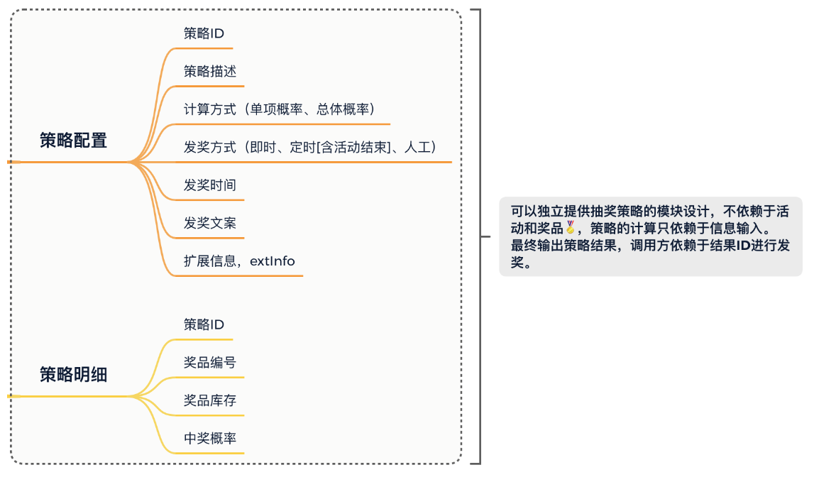

# 抽奖策略领域模块开发


## 概述


* 在domain抽奖领域模块实现两种抽奖策略算法，包括：单项概率抽奖和整体概率抽奖，并提供统一的调用方式
* 对于抽奖策略配置注入使用 list + 枚举 的方式进行优化，参考issue： DrawConfig.java -> #54

## 需求


&emsp;在一场营销抽奖活动玩法，运营人员通常会配置以转盘、盲盒等展现形式的抽奖玩法。每一个奖品配置不同的中奖概率。那么再抽奖时，是剩余的奖品总概率均匀分配在11个奖品上，还是保持剩余11个奖品的中奖概率，如果抽到为空的奖品则表示未中奖。其实这两种方式在实际的运营过程中都会有所选取，主要是为了配合不同的玩法。


## 设计


&emsp;那么我们在做这样的抽奖领域模块设计时，就要考虑到库表中要有对应的字段来区分当前运营选择的是什么样的抽奖策略。那么在开发实现上也会用到对应的策略模式的使用，两种抽奖算法可以算是不同的抽奖策略，最终提供统一的接口包装满足不同的抽奖功能调用

  

* 在库表设计的基础上 添加抽奖需要的策略配置和策略明细
* 很重要的是，**为了让抽奖策略成为可以独立配置和使用的领域模块，在策略表用不引入活动ID信息的配置，因为在建设领域模块的时候，我们需要把让这部分的领域是实现具有可独立运行的特性，不让他被业务逻辑污染，他只是一种无业务逻辑的通用共性的功能领域模块，在业务组合的过程中可以使用此功能领域提供的标准接口**
* 通过这样的设计实现，就可以满足于不同业务场景的灵活调用，**比如，有些业务场景需要你直接来进行抽奖反馈中奖信息发送给用户，但是有一些因为用户下单支付才满足抽奖条件的场景对应的奖品是需要延时到账的。**

## 领域功能结构

&emsp;抽奖系统工程采用DDD架构 + Module模块方式搭建，lottery-domain 是专门用于开发领域服务的模块，不限于目前的抽奖策略在此模块下实现还有以后需要实现的活动领域、规则引擎、用户服务等都需要在这个模块实现对应的领域功能.


&emsp;strategy 是第1个在 domain 下实现的抽奖策略领域，在领域功能开发的服务下主要含有model、repository、service三块区域，接下来分别介绍下在抽奖领域中这三块区域都做了哪些事情。


* model 用于提供vo req res 和aggregates聚合对象
* repository 提供仓储服务其实就是对MySQL Redis等数据的统一包装
* service是具体的业务领域逻辑实现层，在这个包下面定义了algorithm抽奖算法实现和具体的抽奖策略包装draw层，对外提供抽奖接口


## 领域驱动设计


* model  聚合对象
这个包包含了与领域相关的核心业务逻辑和数据结构。模型代表了你在解决问题领域时所涉及的概念和实体，这些实体可能包括各种对象、值对象、聚合根等。这些模型对象封装了业务规则和操作，它们是领域的核心部分。通过将模型从其他层（如UI、数据库等）隔离出来，可以确保业务逻辑的清晰性，并且可以更容易地对其进行测试和演化。

* Repository  数据仓储

仓储层负责处理数据持久化和检索的操作。它是模型与数据存储（通常是数据库）之间的中间层。仓储负责将模型对象存储到数据库中，并从数据库中检索模型对象。它隐藏了底层数据访问细节，使模型层与数据访问逻辑解耦。这有助于保持模型的独立性，使其更加专注于业务逻辑。


* Service  领域服务
服务层包含了那些不适合归属于单个模型对象的操作。这些操作可能涉及多个模型对象之间的协调，或者涉及到跨领域的业务流程。服务层的作用是提供一种聚合或编排模型对象以完成特定业务需求的方式。它可以看作是一个操作模型的高级接口，对外提供了业务功能的抽象。


## 实体类


* 在infraStructure模块下面添加几个实体类


* Award

```java
package cn.itedus.lottery.infrastructure.po;
import java.util.Date;

/**
 * 博客：https://bugstack.cn - 沉淀、分享、成长，让自己和他人都能有所收获！
 * 公众号：bugstack虫洞栈
 * Create by 小傅哥(fustack)
 */

// 奖品类
public class Award {

    // 自增ID
    private Long id;

    // 奖品ID
    private String awardId;

    // 奖品类型（文字描述、兑换码、优惠券、实物奖品暂无）
    private Integer awardType;

    // 奖品数量
    private Integer awardCount;

    // 奖品名称
    private String awardName;

    // 奖品内容「文字描述、Key、码」
    private String awardContent;

    // 创建时间
    private Date createTime;

    // 修改时间
    private Date updateTime;

    public Long getId() {
        return id;
    }

    public void setId(Long id) {
        this.id = id;
    }

    public String getAwardId() {
        return awardId;
    }

    public void setAwardId(String awardId) {
        this.awardId = awardId;
    }

    public Integer getAwardType() {
        return awardType;
    }

    public void setAwardType(Integer awardType) {
        this.awardType = awardType;
    }

    public Integer getAwardCount() {
        return awardCount;
    }

    public void setAwardCount(Integer awardCount) {
        this.awardCount = awardCount;
    }

    public String getAwardName() {
        return awardName;
    }

    public void setAwardName(String awardName) {
        this.awardName = awardName;
    }

    public String getAwardContent() {
        return awardContent;
    }

    public void setAwardContent(String awardContent) {
        this.awardContent = awardContent;
    }

    public Date getCreateTime() {
        return createTime;
    }

    public void setCreateTime(Date createTime) {
        this.createTime = createTime;
    }

    public Date getUpdateTime() {
        return updateTime;
    }

    public void setUpdateTime(Date updateTime) {
        this.updateTime = updateTime;
    }
}

```

* Strategy


```java

package cn.itedus.lottery.infrastructure.po;

import java.util.Date;

/**
 * 博客：https://bugstack.cn - 沉淀、分享、成长，让自己和他人都能有所收获！
 * 公众号：bugstack虫洞栈
 * Create by 小傅哥(fustack)
 * <p>
 * 策略配置
 */


// 策略类
public class Strategy {

    // 自增ID
    private Long id;

    // 策略ID
    private Long strategyId;

    // 策略描述
    private String strategyDesc;

    // 策略方式「1:单项概率、2:总体概率」
    private Integer strategyMode;

    // 发放奖品方式「1:即时、2:定时[含活动结束]、3:人工」
    private Integer grantType;

    // 发放奖品时间
    private Date grantDate;

    // 扩展信息
    private String extInfo;

    // 创建时间
    private Date createTime;

    // 修改时间
    private Date updateTime;

    public Long getId() {
        return id;
    }

    public void setId(Long id) {
        this.id = id;
    }

    public Long getStrategyId() {
        return strategyId;
    }

    public void setStrategyId(Long strategyId) {
        this.strategyId = strategyId;
    }

    public String getStrategyDesc() {
        return strategyDesc;
    }

    public void setStrategyDesc(String strategyDesc) {
        this.strategyDesc = strategyDesc;
    }

    public Integer getStrategyMode() {
        return strategyMode;
    }

    public void setStrategyMode(Integer strategyMode) {
        this.strategyMode = strategyMode;
    }

    public Integer getGrantType() {
        return grantType;
    }

    public void setGrantType(Integer grantType) {
        this.grantType = grantType;
    }

    public Date getGrantDate() {
        return grantDate;
    }

    public void setGrantDate(Date grantDate) {
        this.grantDate = grantDate;
    }

    public String getExtInfo() {
        return extInfo;
    }

    public void setExtInfo(String extInfo) {
        this.extInfo = extInfo;
    }

    public Date getCreateTime() {
        return createTime;
    }

    public void setCreateTime(Date createTime) {
        this.createTime = createTime;
    }

    public Date getUpdateTime() {
        return updateTime;
    }

    public void setUpdateTime(Date updateTime) {
        this.updateTime = updateTime;
    }
}


```

* StrategyDetail


```java

package cn.itedus.lottery.infrastructure.po;

import java.math.BigDecimal;

/**
 * 博客：https://bugstack.cn - 沉淀、分享、成长，让自己和他人都能有所收获！
 * 公众号：bugstack虫洞栈
 * Create by 小傅哥(fustack)
 * <p>
 * 策略明细
 */

// 策略明细类
public class StrategyDetail {

    // 自增ID
    private String id;

    // 策略ID
    private Long strategyId;

    // 奖品ID
    private String awardId;

    // 奖品数量
    private String awardCount;

    // 中奖概率
    private BigDecimal awardRate;

    // 创建时间
    private String createTime;

    // 修改时间
    private String updateTime;

    public String getId() {
        return id;
    }

    public void setId(String id) {
        this.id = id;
    }

    public Long getStrategyId() {
        return strategyId;
    }

    public void setStrategyId(Long strategyId) {
        this.strategyId = strategyId;
    }

    public String getAwardId() {
        return awardId;
    }

    public void setAwardId(String awardId) {
        this.awardId = awardId;
    }

    public String getAwardCount() {
        return awardCount;
    }

    public void setAwardCount(String awardCount) {
        this.awardCount = awardCount;
    }

    public BigDecimal getAwardRate() {
        return awardRate;
    }

    public void setAwardRate(BigDecimal awardRate) {
        this.awardRate = awardRate;
    }

    public String getCreateTime() {
        return createTime;
    }

    public void setCreateTime(String createTime) {
        this.createTime = createTime;
    }

    public String getUpdateTime() {
        return updateTime;
    }

    public void setUpdateTime(String updateTime) {
        this.updateTime = updateTime;
    }
}
```


