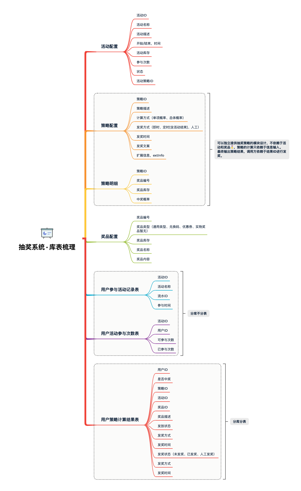

# 活动表的设计

## 表

  

* 活动配置 activity 提供活动的基本配置
* 策略配置 strategy:用于配置抽奖策略 概率 玩法 库存 奖品
* 策略明细 strategy_detail 抽奖策略的具体明细配置
* 奖品配置 award 用于配置具体可以得到的奖品
* 用户参与活动记录表，user_take_activity：每个用户参与活动都会记录下他的参与信息，时间、次数
* 用户活动参与次数表，user_take_activity_count：用于记录当前参与了多少次
* 用户策略计算结果表，user_strategy_export_001~004：最终策略结果的一个记录，也就是奖品中奖信息的内容

&emsp;这些库表是用于支撑起抽奖系统开发的必备表，后续可能会随着功能的开发做适当的调整。接下来我们会围绕这些库表一点点实现各个领域的功能，包括：抽奖策略领域、奖品发放领域、活动信息领域等
